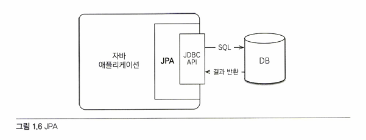
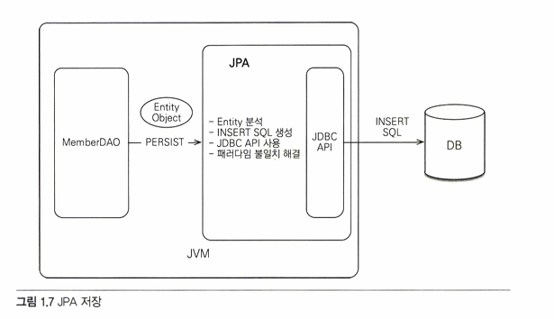
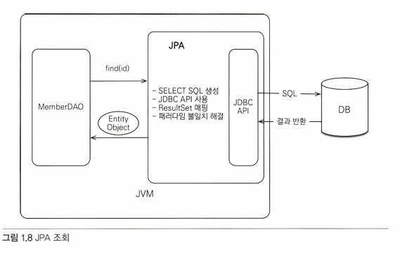
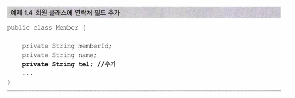
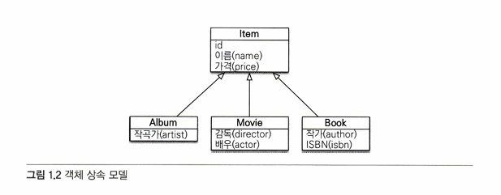
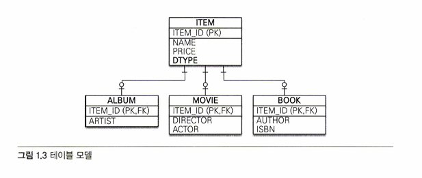
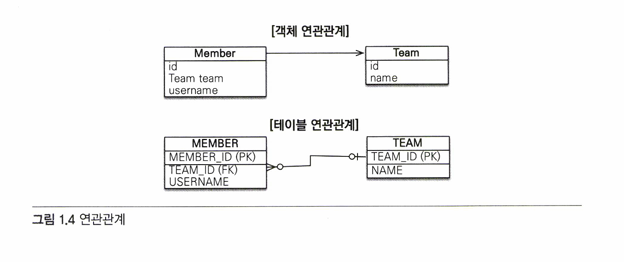
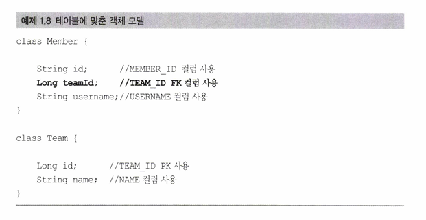
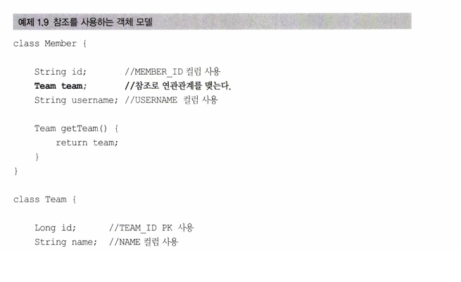
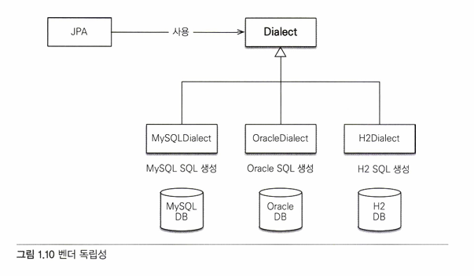

01 JPA 소개
===========

## 1. JPA란?
### JPA(Java Persistence API): 자바진영의 *ORM 기술 표준

   
JPA는 자바 애플리케이션과 JDBC 사이에서 동작한다.
   
### ORM(Object--Relational Mapping): 객체와 관계형 데이터베이스를 매핑한다.
ORM 프레임워크는 객체와 테이블을 매핑해서 패러다임의 불일치 문제를 개발자 대신 해결해준다.   
   
   
EX) 저장(insert)   
   
객체를 DB에 저장할 때 INSERT SQL을 직접 작성X,   
객체를 자바 컬렉션에 저장하듯이 ORM 프레임워크에 저장   
-> ORM 프레임워크가 적절한 INSERT SQL을 생성해서 DB에 객체 저장   
   
- 객체를 저장할 때의 코드
```
jpa.persist(member); // 저장
```
   
EX) 저장(update)   
JPA는 별도의 수정 메서드를 제공X   
find 메서드로 객체 조회 후 set_ 메서드 값을 변경하면, 트랜잭션을 커밋할 때 적절한 UPDATE SQL이 전달   
   
- 객체를 저장할 때의 코드
```
Member member = jpa.find(Member.class, memberId);   
member.setName("이름변경"); // 수정
```
   
EX) 조회   
   
객체를 DB에서 조회할 때 SELECT SQL을 직접 작성X   
ResultSet을 매핑해서 객체를 조회   
   
- 객체를 조회할 때의 코드
```
Member member = jpa.find (memberId) ; //조회
```
   
 ** **하이버네이트(hibernate)** 프레임워크: 객체 하나를 CRUD 해줄 뿐만 아니라, 
 대부분의 패러다임 불일치 문제를 해결해주는 ORM 프레임워크
   
## 2. JPA를 사용하는 이유
- 생산성   
지루하고 반복적인 코드와 CRUD용 SQL을 자동으로 JPA가 대신 처리
   
+ 더 나아가서 엔티티만 등록해놓으면 DDL을 자동으로 작성하여 테이블을 생성하거나 수정해주는 ddl-auto 설정을 사용해서 CREATE TABLE같은 DDL문을 자동으로 생성해주기도 한다.
-> DB 설계 중심의 패러다임을 객체 설계 중심으로 역전시킬 수 있다 (???????)
   
**but** 운영에서는 가급적 사용x, 만약 사용할 시에는 주의해서 사용할 것   
∵ create / create-drop으로 설정했을 시에는 운영DB의 테이블이 모두 삭제될 수도 있기 때문에
   
- 유지보수
테이블의 필드를 추가하거나 삭제, 수정하거나, 데이터베이스를 중간에 바꾸더라도(ex. oracle -> mysql), 수정해야될 코드가 적다.
   
ex. Member 객체에 tel 필드가 추가될 때 기존 프로세스   
1. 회원 객체에 필드 추가   
   
   
2. INSERT SQL 수정   
```
 String sql = "INSERT INTO MEMBER(MEMBER_ID, NAME, TEL) VALUES(?,?,?);
```
   
3-1. 조회쿼리 변경    
```
 SELECT MEMBER_ID, NAME, TEL FROM MEMBER WHERE MEMBER_ID = ?
```
   
3-2. 연락처의 조회결과를 Member 객체에 추가로 매핑
```
 String tel = rs.getString("TEL"); 
 member.setTel (tel) ; // 추가
```
   
4. 수정을 위한 코드 변경   
```
list.add (member); // 등록
Member member = list.get (xxx); // 조회
member.setTel("xxx"); // 수정
```
-> JPA를 사용하면 일일이 할 필요 X   
   
- 패러다임의 불일치 해결
관계형 데이터베이스는 데이터 중심으로 구조화되어있고, 집합적인 사고를 요구한다. (??)
그리고 객체지향에서 이야기하는 추상화, 상속, 다형성 같은 개념이 없다.   
이는 객체와 관계형 데이터베이스가 지향하는 목적이 서로 다르기 때문인데, 그렇기에 둘의 기능과 표현 방법도 다르다. => **객체와 관계형 데이터베이스의 패러다임 불일치 문제**   
<br/>
1. 상속
   
객체는 상속이라는 기능을 갖고 있지만, 테이블은 상속이라는 기능이 없다.   
<br/>
그나마 데이터베이스 모델링에서 이야기하는 슈퍼타입 서브타입 관계를 사용하면 객체 상속과 가장 유사한 형태로 테이블을 설계할 수 있다.

<br/>
JDBC API를 사용해서 이 코드를 완성하려면 부모 객체에서 부모 데이터만 꺼내서 ITEM용 INSERT SQL을 작성하고 자식 객체에서 자식 데이터만 꺼내서 ALBUM용 INSRT SQL을 작성 해야하는데，작성해야 할 코드량이 만만치 않다. 그리고 자식 타입에 따라서 DTYPE도 저장해야 한다.   
   
JPA를 사용한다면 위의 경우에도   
```
jpa.persists(album);
```
persist(); 메서드를 사용해서 객체를 저장한다. 이렇게 하면, JPA가 알아서 아래의 SQL을 실행해서 객체를 ITEM, ALBUM 두 테이블에 나눠서 저장한다.   
<br/>
```
INSERT INTO ITEM ...
INSERT INTO ALBUM ...
```
<br/>
다음으로 Album 객체를 조회해보자. find() 메서드를 사용해서 객체를 조회하면 된다.   
<br/>
```
String albumId = "id100";
Album album = jpa.find(Album.class, albumId);
```
<br/>
JPA는 알아서 ITEM, ALBUM 두 테이블을 조인해서 필요한 데이터를 조회하고 그 결과를 반환한다.   
```
SELECT I.*, A.*
  FROM ITEM I
     , ALBUM A
 WHERE I.ITEM_ID = A.ITEM_ID
```
<br/>
2. 연관관계   
객체: 참조를 사용해서 연관된 객체 조회   
테이블: 외래키를 사용해서 연관된 테이블 조회   

   
Member 객체는 Member.team  필드에 Team 객체의 참조를 보관해서 Team 객체와 관계를 맺는다.   
=> Team 참조필드에 접근하면, Member와 연관된 Team 조회 가능   

그러나, MEMBER 테이블은, FK인 TEAM_ID로 참조를 하고 있다.   
외래키 TEAM_ID를 사용해서 MEMBER 테이블과 TEAM 테이블을 조인하면, MEMBER 테이블과 연관된 TEAM 테이블 조회 가능   

**객체는 참조가 있는 방향으로만 조회할 수 있기 때문에, 단순 조회 시 member.getTeam()은 가능하지만, 반대로 team.getMember()는 불가능하다.   반면에 테이블은 외래키 하나로 MEMBER JOIN TEAM, TEAM JOIN MEMBER가 가능하다.**
   
   
위처럼 Team 객체가 아닌, teamId 컬럼을 사용해 Member 클래스를 만들 수도 있긴 하다.   
이렇게 객체를 테이블에 맞춰 모델링하면 객체를 테이블에 저장하거나 조회할 때에는 편리하지만,   
```
Team team = member.getTeam();
```
처럼 참조를 통해 연관된 객체를 찾을 수 없다.   
그렇게 된다면, 좋은 객체 모델링은 기대하기 어렵고, 결국 객체지향의 특징을 잃어버리게 된다.   
<br/>
**객체지향 모델링**   
객체는 참조를 통해서 관계를 맺기 때문에 아래처럼 teamId가 아닌, Team 객체를 참조하도록 모델링해야 한다.   
   
이제 아래처럼 조회가 가능해진다.   
```
Team team = member.getTeam();
```
그러나 이처럼 객체지향 모델링을 사용하면, 객체를 테이블에 저장하거나 조회하기 쉽지X   
(∵ 객체 모델은 외래 키가 필요 없고, 참조만 있으면 되지만 테이블은 참조가 필요 없고 외래키만 있으면 되기 때문)   
∴ 개발자가 중간에서 변환 역할을 해야한다.   
<br/>
* 저장
객체를 DB에 저장하려면 team 필드를 TEAM_ID FK 값으로 변환해야된다.
```
member.getId();           // MEMBER_ID PK에 저장
member.getTeam().getId(); // TEMAM_ID FK에 저장
member.getUsername();     // USERNAME 컬럼에 저장
```

* 조회
조회할 때에는 TEAM_ID FK 값을 Member 객체의 team 참조로 변환해서 객체에 보관해야 한다.
먼저 아래 SQL처럼 MEMBER, TEAM을 조회한다.   
```
SELECT M.*, T.*
  FROM MEMBER M
     , TEAM T
 WHERE M.TEAM_ID = T.TEAM_ID
```

후에는 아래처럼 객체 생성, 연관관계를 설정해서 SQL 결과를 반환한다.   
```
public Member find (String member Id) {
    // SQL 실행
   Member member = new Member();
    // 데이터베이스에서 조회한 회원 관련 정보를 모두 입력
   Team team = new Team();
    // 데이터베이스에서 조회한 팀 관련 정보를 모두 입력
    // 회원과팀 관계 설정
   member.setTeam (team);

   return member;
}
```
-> 할 일이 굉장히 많다 ;;;;;; 귀찮다~~   
하지만, 자바 컬렉션에 회원 객체를 저장한다면 이렇게 하지 않아도 됨 !   
<br/>

**JPA와 연관관계**   

- 성능
JPA는 애플리케이션과 DB 사이에서 다양한 성능 최적화 기회를 제공한다.
   
```
 String member Id = "hellold";
 Member member1 = jpa.find(memberId);
 Member member2 = jpa.find(memberld);
```
위 코드는 같은 트랜잭션 안에서 같은 회원을 두 번 조회하는 코드이다.   
   
기존의 자바 코드를 사용한다면, getMember(memberId); 등의 메서드로 Member 객체를 가져올 것.   
이럴 때에는 member1과 member2 객체가 다르다고 반환된다.
   
그러나 JPA를 사용하면 find(memberId); 메서드로 회원을 조회하는 SELECT SQL을 한 번만 데이터베이스에 전달하고, 두 번째는 조회한 회원 객체를 재사용한다.   
   
- 데이터 접근 추상화와 벤더 독립성   
   
페이징처리와 같은 것들은 DB마다 처리법이 달라서(ROWNUM(ORACLE, Mari DB), LIMIT(MySQL, Maria DB), TOP(MSSQL))   
사용법을 각각 배워야되는데, 특정 DB 기술에 종속되지 않도록 한다.   
   
객체를 영속화할 때 내부적으로 발생하는 SQL이 알아서 변경   
   
- 표준   
JPA는 자바 진영의 ORM 기술 표준이다. 앞서 이야기했듯이 표준을 사용하면 다른 구현 기술로 손쉽게 변경할 수 있다. (???)    
   
## 3. 느낀점    
너무 오래 전에 공부하고, 후에 강의를 얕게나마 들었던지라 JPA라 하면 테이블에 맞춰서 객체를 만들면 쿼리를 직접 짜주는 정도로만 생각했었다.   
아직 겉핥기 식으로만 공부를 했고, 실무로 사용을 안해봐서 편한지도 잘 모르겠지만, 실제로 Mybatis를 사용한 후에 JPA로 넘어간 사람들이 편하다고 하는 것을 보면 얼마나 편하길래 ..   
흥미가 생기긴 한다. 그러나 JPA를 사용하려면 더더욱 테이블 구조 설계를 잘 해야될 것 같은 느낌이 든다.   
추가로 통계같은 복잡한 쿼리는 어쩌지 ! 싶었는데, 그런건 직접 SQL로 짜는 것이 낫다고 하니, SQL도 까먹으면 안 될 것 같다. 해야 될 것들이 참 많은 세상이다.
   
***
* **지연로딩**: Member를 조회하는 시점이 아닌 실제 Team을 사용하는 시점에 쿼리가 나가도록 할 수 있다는 장점이 있다. -> 성능 측면에서 good
* **패러다임**: 이론적 틀이나 개념의 집합
