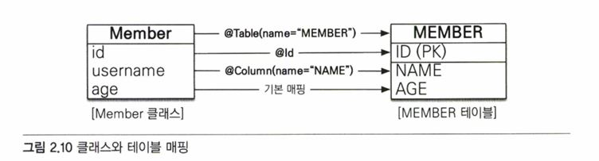

# 02 JPA 시작   
## 2.1 이클립스 설치와 프로젝트 불러오기   
＊ 이클립스는 최소한 LUNA 버전 이상 설치해야된다.   
(∵ 예제 실행을 위해서는 메이븐(Maven)이 설치되어 있어야 하는데, LUNA버전부터 메이븐이 내장되어 있기 때문)   
   
## 2.2 H2 데이터베이스 설치   
H2 데이터베이스는 설치가 필요 없고, 용량도 가볍다.   

## 2.3 라이브러리와 프로젝트 구조
- JPA 구현체로 하이버네이트를 사용하기 위한 핵심 라이브러리
  - hibernate-core: 하이버네이트 라이브러리
  - hibernate-entitymanager: 하이버네이트가 JPA 구현체로 동작하도록 JPA 표준을 구현한 라이브러리
  - hibernate-jpa-2.1-api: JPA 2.1 표준 API를 모아둔 라이브러리

예제에 사용할 프로젝트 구조는 아래와 같다.   
   

### 2.3.1 메이븐과 사용 라이브러리 관리   
라이브러리는 메이븐을 사용해서 관리한다.   
   
**메이븐(Maven)**: 자바 애플리케이션에서 라이브러리를 관리하고 빌드하는 도구.   
1. 라이브러리 관리 기능
자바 애플리케이션을 개발하기 위해서는 .jar 파일로 된 여러 라이브러리가 필요한데,
과거에는 이런 라이브러리를 직접 내려받아 사용했다면,
메이븐은 사용할 라이브러리 이름과 버전만 명시하면 라이브러리를 자동으로 내려받고 관리해준다.

2. 빌드 기능
애플리케이션을 빌드하는 표준화된 방법을 제공한다.
   
<hr/>
   
   
[↑ 메이븐 설정 파일 pom.xml]   

<dependencies>에 사용할 라이브러리를 지정한다.   
groupId + artifactId + version만 적어주면, 라이브러리(.jar 파일)를 메이븐 공식 저장소에서 내려받아 라이브러리에 추가해준다.   

＊ JPA에 하이버네이트 구현체를 사용하기 위한 핵심 라이브러리   
1. **JPA, 하이버네이트**(hibernate-entitymanager): JPA 표준과 하이버네이트를 포함하는 라이브러리
2. **H2 데이터베이스**: H2 데이터베이스에 접속해야 하므로 필요
   
## 2.4 객체 매핑 시작   
   
[↑ 예제에서 사용할 회원 테이블의 CREATE SQL]   

```java
package jpabook.start;

public class Member {
  private String id;
  private String username;
  private Integer age;

  // Getter, Setter
  public String getId() {return id;}
  public void setId(String id) {this.id = id;}

  public String getUsername() {return username;}
  public void setUsername(String username) {this.username = username;}

  public Integer getAge() {return age;}
  public void setAge(Integer age) {this.age = age;}
}
```
[↑ 예제에서 사용할 회원 객체 클래스]   

JPA를 사용하기 위해서는 회원 테이블(MEMBER)와 회원 클래스(Member)를 매핑해야한다.   
아래의 표는 둘을 비교하며, 실제 매핑을 하는 것.   
   

```java
package jpabook.start;

import javax.persistence.*; // ★★★★★

@Entity // ★★★★★
@Table(name = "MEMBER") // ★★★★★
public class Member {

  @Id // ★★★★★
  @Column(name = "ID) // ★★★★★
  private String id;

  @Column(name = "NAME") // ★★★★★
  private String username;

  // 매핑정보가 없는 필드
  private Integer age;

  ...
}
```
[↑ 회원 클래스에 JPA가 제공하는 매핑 어노테이션을 추가한 것]   

   
[↑ 클래스와 테이블 매핑]   

JPA는 매핑 어노테이션을 분석해서 어떤 객체가 어떤 테이블과 관계가 있는지 알아낸다.   
   
**@Entity**   
이 클래스를 테이블과 매핑한다고 JPA에게 알려준다. 이렇게 @Entity가 사용된 클래스를 엔티티 클래스라 한다.   

**@Table**   
엔티티 클래스에 매핑할 테이블 정보를 알려준다. 이 어노테이션을 생략하면, 클래스 이름을 테이블 이름으로 매핑한다.   

**@Id**   
엔티티 클래스의 필드를 테이블의 기본키(PK)에 매핑한다. @Id가 사용된 필드를 식별자 필드라 한다.   

**@Column**   
필드를 컬럼에 매핑한다.   

**매핑 정보가 없는 필드**   
예시에서 age 필드에는 매핑 어노테이션이 없다. 매핑 어노테이션을 생략하면, 필드명을 사용해서 컬럼명으로 매핑한다.   
(만약 대소문자를 구분하는 데이터베이스를 사용하면 @Column(name = "AGE")처럼 명시적으로 매핑해야 한다.   

＊ JPA 어노테이션의 패키지는 javax.persistence이다.   

## 2.5 persistence.xml 설정   
JPA는 persistence.xml을 사용해서 필요한 설정 정보를 관리한다. (경로: META-INF/persistence.xml)   

   

설정 파일은 <persistence> 태그로 시작한다. XML 네임스페이스(XML 문서에서 요소 유형 및 속성 이름으로 사용되는 이름 콜렉션으로서, URI 참조로 식별됩니다.)와 사용할 버전을 지정. 위 예시에선, JPA 2.1을 사용한다고 명시했다.   

<persistence-unit name = "jpabook" >: JPA 설정은 영속성 유닛이라는 것부터 시작하는데, 일반적으로 연결할 DB당 하나의 영속성 유닛을 등록한다.   
그리고 영속성 유닛에는 고유한 이름을 부여해야 하는데, 여기에서는 jpabook이라는 이름을 사용.   
＊ **영속성 유닛**: 응용프로그램의 EntityManager 인스턴스에 의해 관리되는 모든 엔티티 클래스 집합을 정의한다.   

- JPA 표준 속성
  - javax.persistence.jdbc.driver: JDBC 드라이버
  - javax.persistence.jdbc.user: 데이터베이스 접속 아이디
  - javax.persistence.jdbc.password: 데이터베이스 접속 비밀번호
  - javax.persistence.jdbc.url: 데이터베이스 접속 URL
   
- 하이버네이트 속성
  - hibernate.dialect: DB 방언 설정

### 2.5.1 데이터베이스 방언   
JPA는 특정 DB에 종속적이지 않은 기술이다. => DB를 손쉽게 교체 가능   

그러나 각 DB가 제공하는 SQL문법과 함수가 조금씩 다르다는 문제점이 존재.   
EX)   
* 데이터타입 : 가변 문자타입으로 MySQL: VARCHAR / ORACLE: VARCHAR2 사용
* 함수명     : 문자열을 자르는 함수로 SQL 표준: SUBSTRING() / ORACLE: SUBSTR() 사용
* 페이징 처리: MySQL: LIMIT / ORACLE: ROWNUM 사용
위 같은 DB만의 고유한 기능을 JPA에서는 방언이라 하고, 이런 다르다는 문제를 해결하기 위해 다양한 DB 방언 클래스를 제공한다.
   
## 2.6 애플리케이션 개발   
```java
package jpabook.start;

import javax.persistence.*;
import java.util.List;

public class JpaMain {
  public static void main(String[] args) {
    // 엔티티 매니저 팩토리 생성
    EntityManagerFactory emf = Persistence.createEntityManagerFactory("jpabook");

    // 엔티티 매니저 생성
    EntityManager em = emf.createEntityManager();

    // 트랜잭션 획득
    EntityTransaction tx = em.getTransaction();

    try {
      tx.begin();   // 트랜잭션 시작
      logic(em);    // 비즈니스 로직 실행
      tx.commit (); // 트랜잭션 커밋
    } catch (Exception e) {
      tx. rollback () ; // 트랜잭션 롤백
    } finally {
      em. close (); // 엔티티 매니저 종료
    }
   emf.close (); // 엔티티 매니저 팩토리 종료
  }

  // 비즈니스 로직
  private static voic login(EntityManager em) {...}
}
```
[↑ 애플리케이션을 시작하는 코드]   

위에서 코드는 크게 3부분으로 나뉘어 있다.   
* 엔티티 매니저 설정
* 트랜잭션 관리
* 비즈니스 로직
   
### 2.6.1 엔티티 매니저 설정      
   

* 엔티티 매니저 팩토리 생성
JPA를 생성하기 위해서는 persistence.xml의 설정 정보를 사용해, 엔티티 매니저 팩토리를 생성해야 한다.
EntityManagerFactory emf = Persistence.createEntityManagerFactory("jpabook");
위처럼 한다면, META-INF/persistence.xml에서 이름이 "jpabook"인 영속성 유닛을 찾아서 엔티티 매니저 팩토리를 생성한다.
이때 드는 비용은 굉장히 크기 때문에, 엔티티 매니저 팩토리는 애플리케이션 전체에서 딱 한 번만 생성해서 공유하며 사용해야 한다.
   
* 엔티티 매니저 생성
엔티티 매니저를 사용해서 데이터베이스에 엔티티를 등록/수정/삭제/조회할 수 있다.
**엔티티 매니저는 DB커넥션과 밀접한 관계가 있기 떄문에 스레드 간에 공유하거나 재사용은 하면 안 된다.**
   
* 종료
사용이 끝났다면 엔티티매니저와 엔티티매니저 팩토리를 종료해야 한다.

### 2.6.2 트랜잭션 관리   
JPA를 사용하면 항상 트랜잭션 안에서 데이터를 변경해야 한다. 트랜잭션 없이 데이터를 변경하면 예외가 발생한다.   

   
트랜잭션 API를 사용해서 비즈니스 로직이 정상 동작하면 트랜잭션을 커밋하고, 예외가 발생하면 트랜잭션을 롤백한다.   

### 2.6.3 비즈니스 로직   
   
비즈니스 로직을 보면 CRUD 작업이 엔티티 매니저(em)을 통해서 수행되는 것을 알 수 있다.   

### 2.6.4 JPQL   
```java
// 목록 조회
TypedQuery<Member> query = em. createQuery("select m from Member m", Member.class);
List<Member> members = query.getResultList();
```
JPA를 사용하면 개발자는 엔티티 객체를 중심으로 개발하고, 데이터베이스에 대한 처리는 JPA에 맡겨야 한다.   
테이블이 아닌 엔티티 객체를 대상으로 검색하는 데에 불편함이 있기에 JPQL(Java Persistence Query Language)이라는 쿼리 언어가 생겼다.   
SQL과 문법이 비슷해서 SELECT, FROM, WHERE, GROUP BY, HAVING, JOIN 등을 사용할 수 있지만 차이점이 있긴 하다.   
   
- JPQL은 엔티티 객체를 대상으로 쿼리를 한다. (클래스와 필드를 대상으로)
- SQL은 데이터베이스 테이블을 대상으로 쿼리를 한다.

```
SELECT m from Member m
```
이게 JPQL이다.! Member는 MEMBER 테이블이 아니라, Member 객체다.   

<hr>
느낀점   
JPQL은 DB 테이블을 전혀 알지 못한 다는 것을 기억하자 ...
