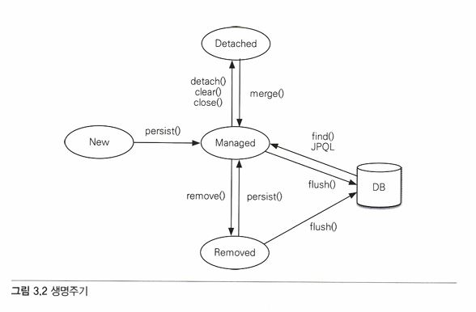
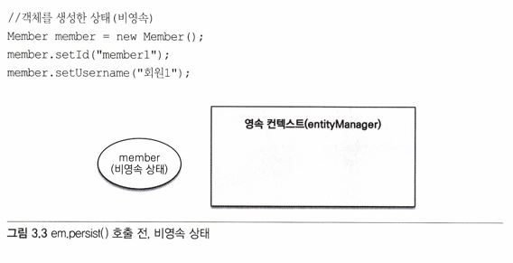

# 03. 영속성 관리   
   
JPA가 제공하는 기능   
1. 엔티티와 테이블을 매핑하는 **설계** 부분
2. 매핑한 **엔티티를 실제 사용**하는 부분   
   
이 장에서는 후자에 대해 알아본다.   
   
## 3.1 엔티티 매니저 팩토리와 엔티티 매니저   
```java
// EntityManagerFactory 비용이 많이 든다.
EntityManagerFactory emf = Persistence.ereateEntityManagerFactory("jpabook");
```
애플리케이션은 위의 코드를 사용해, META-INF/persistence.xml에 있는 정보를 바탕으로 EntityManagerFactory를 하나만 생성한다.      
   
   
   
엔티티 매니저 팩토리 생성 후에는 필요할 때마다 엔티티 매니저 팩토리에서 엔티티 매니저를 생성하면 된다.   
```java
// EntityManager 생성. 비용이 거의 안 든다.
EntityManager em = emf.createEntityManager();
```
   
엔티티 매니저 팩토리: 여러 스레드가 동시에 접근해도 안전 => 서로 다른 스레드 간 공유 가능   
엔티티 매니저: 여러 스레드가 동시에 접근하면 동시성 문제 발생 => 서로 다른 스레드 간 공유 x   

   
위 그림을 보면, 하나의 EntityManagerFactory에 다수의 엔티티 매니저를 생성했다.   
엔티티 매니저는 데이터베이스 연결이 꼭 필요한 시점까지 커넥션을 얻지 않는다.   
=> EntityManager1은 커넥션 사용x, EntityManager2는 커넥션 사용o   
   
**보통 트랜잭션을 시작할 때 커넥션을 획득한다.**   
   
## 3.2 영속성 컨텍스트   
**영속성 컨텍스트**: 엔티티를 영구 저장하는 환경   
엔티티 매니저는 엔티티를 저장, 조회할 수 있기 때문에 영속성 컨텍스트에 엔티티를 보관, 관리하는 격.   
   
```java
em.persist(member);
```
위 코드는 단순히 회원 엔티티를 저장하는 것이 아니라, 엔티티 매니저를 사용해, 회원 엔티티를 영속성 컨텍스트에 저장하는 것.   
   
## 3.3 엔티티의 생명주기   
|상태|설명|
|------|---------------|
|비영속(new/transient)|영속성 컨텍스트와 전혀 관계가 없는 상태|
|영속(managed)|영속성 컨텍스트에 저장된 상태|
|준영속(detached)|영속성 컨텍스트에 저장되었다가 분리된 상태|
|삭제(removed)|삭제된 상태|
   
   
[↑ 엔티티의 생명주기를 나타낸 그림]   

* 비영속   
   
엔티티 객체만 생성했고, 저장은 하지 않은 상태로 영속성 컨텍스트나 DB와는 전혀 관련이 없는 상태.
   
* 영속   
   
엔티티를 영속성 컨텍스트에 저장(em.persists)한, 영속성 컨텍스트가 관리하는 엔티티의 상태.
em.fine()나 JPQL을 사용해서 조회한 엔티티도 영속성 컨텍스트가 관리하는 영속상태다.
   
* 준영속
영속성 컨텍스트가 관리하던 영속 상태의 엔티티를 영속성 컨텍스트가 관리하지 않은 상태.
   
```java
// 1.
em.detach();

// 2. 영속성 컨텍스트 닫기
em.close();

// 3. 영속성 컨텍스트 초기화
em.clear();
```
위 세 방법을 통해서 영속성 컨텍스트가 관리하던 영속 상태의 엔티티는 준영속 상태가 된다.   
   
* 삭제
엔티티를 영속성 컨텍스트와 데이터베이스에서 삭제한다.
```java
em.remove(member);
```
   
## 3.4 영속성 컨텍스트의 특징   
* 영속성 컨텍스트와 식별자 값
영속 상태는 식별자 값이 반드시 있어야 한다. 식별자 값이 없으면 예외 발생
   
* 영속성 컨텍스트와 데이터베이스 저장
JPA는 보통 트랜잭션을 커밋하는 순간 영속성 컨텍스트에 새로 저장된 엔티티를 데이터베이스에 반영한다. => 플러시(flush)
   
* 영속성 컨텍스트가 엔티티를 관리하면 다음과 같은 장점이 있다.
  * 1차 캐시
  * 동일성 보장
  * 트랜잭션을 지원하는 쓰기 지연
  * 변경 감지
  * 지연 로딩
   
### 3.4.1 엔티티 조회   
영속성 컨텍스트는 내부에 캐시를 가지고 있다. => 1차 캐시   
1차 캐시 안에는 영속 상태의 엔티티가 모두 저장 된다.   
   
영속성 컨텍스트 내부에 Map이 있고, 키는 @Id로 매핑한 식별자, 값은 엔티티 인스턴스.   

   
1차 캐시의 키는 식별자 값이다. 영속성 컨텍스트에 데이터를 저장하고 조회하는 모든 기준은 DB 기본 키 값이다.   
   
```java
Member member = em.fine(Member.class, "member1");
```
   
em.fine()를 호출하면 먼저 1차 캐시에서 엔티티를 찾고, 만약 엔티티가 1차 캐시에 없으면 데이터베이스에서 조회한다.   
   
**1차 캐시에서 조회**   
   
   
**데이터베이스에서 조회**   
em.find()를 호출했는데, 엔티티가 1차 캐시에 없으면 엔티티 매니저는 **데이터베이스를 조회해서 엔티티를 생성한다.**   
생성한 엔티티를 1차 캐시에 저장한 후에 영속 상태의 엔티티를 반환한다.   
   
   
1. em.find(Member.class, "member2")를 실행한다.
2. member2가 1차 캐시에 없으므로 데이터베이스에서 조회한다.
3. 조회한 데이터로 member2 엔티티를 생성해서 1차 캐시에 저장한다. (member2를 영속상태로 만듦)
4. 조회한 엔티티를 반환한다.
   
이제 member1, member2 엔티티 인스턴스는 1차 캐시에 있다. => 이 엔티티들을 조회하면 메모리의 1차 캐시에서 바로 불러온다.   
   
**영속 엔티티의 동일성 보장**
```java
Member a = em.find(Member.class, "member1");
Member b = em.find(Member.class, "member1");

System.out.print(a == b); // true
```
   
em.find(Member.class, "member1")를 반복해서 호출해도 영속성 컨텍스트는 1차 캐시에 있는 같은 엔티티 인스턴스를 반환한다.   
=> 둘은 같은 인스턴스다. **영속성 컨텍스트는 성능상 이점과 엔티티의 동일성을 보장한다.**   
   
### 3.4.2 엔티티 등록   
```java
// 엔티티 등록 코드
EntityManater em = emf.createEntityManager();
EntityTransaction transaction = em.getTransaction();

// 엔티티 매니저는 데이터 변경 시 트랜잭션을 시작해야 한다.
transaction.begin(); // 트랜잭션 시작

em.persist(memberA);
em.persist(memberB);
// 여기까지 INSERT SQL을 데이터베이스에 보내지 않는다.

// 커밋하는 순간 데이터베이스에 INSERT SQL을 보낸다.
transaction.commit(); // 트랜잭션 커밋
```
   
엔티티 매니저는 트랜잭션 커밋 직전까지 내부 쿼리 저장소에 INSERT SQL을 차곡차곡 모아둔다.   
그리고 트랜잭션을 커밋할 때 모아둔 쿼리를 DB에 보낸다. => **쓰기 지연**
   
   
위 그림을 보면, memberA를 우선 영속화했다. 영속성 컨텍스트는 1차 캐시에 회원 엔티티를 저장하면서 INSERT SQL을 만든다. 그리고 해당 SQL을 쓰기 지연 SQL 저장소에 보관한다.   

   
memberA와 동일하게 memberB가 저장된다. 현재 쓰기 지연 SQL 저장소에는 등록 쿼리가 2건 저장되어있다.   
   
   
마지막으로 트랜잭션을 커밋했다. 트랜잭션을 커밋하면 엔티티 매니저는 영속성 컨텍스트를 플러시한다.   
**플러시**: 영속성 컨텍스트의 변경 내용을 DB에 동기화하는 작업   
   
### 3.4.3 엔티티 수정
**SQL 수정 쿼리의 문제점**
컬럼이 추가될 경우에는 수정쿼리를 추가로 작성해야 한다. 같은 테이블을 건드는 수정쿼리임에도 보내는 파라미터 값에 따라서 쿼리를 다르게 만들어서, 수정쿼리가 많아지는 것은 물론이고, 비즈니스 로직 분석을 위해 계속 SQL을 확인해야 한다는 기존 SQL의 문제점이 있다.   
   
**변경 감지**   
```java
EntityManager em = emf.createEntityManager(); 
EntityTransaction transaction = em.getTransaction(); 
transaction.begin (); // [트랜잭션] 시작

// 영속 엔티티 조회
Member member A = em.find (Member.class, "memberA");
// 영속 엔티티 데이터 수정 
memberA.setUsername ("hi"); 
memberA.setAige(10);

// em.update(member) 이런 코드가 있어야 하지 않을까?
 transaction.commit (); // 트랜잭션 커밋
```
   
JPA로 엔티티를 수정할 때에는 단순히 엔티티 조회 후 데이터만 변경하면 된다. (변경감지 기능이 있기 때문)   
   
   
＊ 스냅샷: JPA에서 엔티티를 영속성 컨텍스트에 보관할 때 최초의 상태를 복사해 저장해두는 것   
=> 플러시 시점에 스냅샷과 저장을 위해 넘어온 엔티티를 비교해서 변경된 엔티티를 찾는다.   
   
1. 트랜잭션을 커밋하면 엔티티 매니저 내부에서 먼저 플러시가 호출된다.
2. 엔티티와 스냅샷을 비교해서 변경된 엔티티를 찾는다.
3. 변경된 엔티티가 있으면 수정 쿼리를 생성해서 쓰기 지연 SQL 저장소에 보낸다.
4. 쓰기 지연 저장소의 SQL을 데이터베이스에 보낸다.
5. 데이터베이스 트랜잭션을 커밋한다.
   
**변경감지는 영속성 컨텍스트가 관리하는 영속 상태의 엔티티에만 적용된다.**   
   
   
UPDATE SQL을 수정한 컬럼만 동적으로 생성될 것 같지만, 사실은 위 쿼리처럼 **엔티티의 모든 필드를 업데이트한다.**
   
모든 필드를 UPDATE하는 데에 사용하면 데이터베이스에 보내는 데이터 전송량이 증가하는 단점이 있지만, 아래와 같은 장점 존재   
- 모든 필드를 사용하면 수정쿼리가 항상 같다. => 애플리케이션 로딩 시점에 수정 쿼리를 미리 생성해두고 재사용 가능
- 데이터베이스에 동일한 쿼리를 보내면 데이터베이스는 이전에 한 번 파싱된 쿼리를 재사용 가능
   
필드가 많거나 저장될 내용이 너무 크면 수정된 컬럼의 데이터만 동적으로 UPDATE SQL을 태우게 하면 된다. **hibernate 확장 기능 사용**   
```java
@Entity
@org.hibernate.annotation.DynamicUpdate
@Table(Name = "Member")
public class Member {...}
```
org.hibernate.annotation.DynamicUpdate 어노테이션을 사용하면 수정된 데이터만 동적으로 UPDATE SQL에 태울 수 있다.   
＋ @DynamicInsert도 존재한다.   
   
### 3.4.4 엔티티 삭제   
```java
Member memberA = em.find(Member.class, "memberA"); // 삭제 대상 엔티티 조회
em.remove(memberA); // 엔티티 삭제
```
엔티티 삭제를 위해서는 삭제 대상 엔티티를 먼저 조회한 후, 엔티티 매니저로 삭제를 해야된다. 물론 삭제 쿼리는 지연 SQL 저장소에 등록된 후, 트랜잭션 커밋 시 플러시를 호출하면서 실제 DB에 전달된다.   
＊ 하지만 !!! em.remove(memberA)를 호출하자마자 memberA는 영속성 컨텍스트에서 제거된다.!!   
   
## 3.5 플러시   
**플러시**: 영속성 컨텍스트의 변경 내용을 데이터베이스에 반영한다.   
   
플러시를 실행하면 생기는 일   
1. 변경 감지가 동작해서 영속성 컨텍스트에 있는 모든 엔티티를 스냅샷과 비교해서 수정된 엔티티를 찾는다.
   수정된 엔티티는 수정 쿼리를 만들어 쓰기 지연 SQL 저장소에 등록한다.
2. 쓰기 지연 SQL 저장소의 쿼리를 DB에 전송한다. (CUD 쿼리)
   
＊ 영속성 컨텍스트를 플러시 하는 방법   
1. em.flush()를 직접 호출
2. 트랜잭션 커밋 시 플러시 자동 호출
3. JPQL 쿼리 실행 시 플러시 자동 호출
   
- 직접 호출
엔티티 매니저의 flush() 메서드를 직접 호출해서 영속성 컨텍스트 강제 플러시 (자주 사용x)   
   
- 트랜잭션 커밋 시 플러시 자동 호출
JPA는 트랜잭션을 커밋할 때 자동으로 플러시를 호출한다.
   
- JPQL 쿼리 실행 시 플러시 자동 호출
JPQL이나 Criteria 같은 객체지향 쿼리를 호출할 때도 플러시 실행
   
```java
em.persist(memberA);
em.persist(memberB);
em.persist(memberC);

// JPQL 실행
query = em.createQuery("select m from Member m", Member.class);
List<Member> members = query.getResultList();
```
em.persist()를 호출해서 엔티티 memberA, memberB, memberC를 영속 상태로 만들었지만 아직 커밋x   
이때 조회하는 JPQL을 실행하면, 데이터베이스에서 엔티티를 조회하는데, 엔티티가 없기 때문에 조회되지 않는다.   
=> 쿼리 실행 직전에 영속성 컨텍스트를 플러시해, 변경 내용을 DB에 반영   
   
**＊ 식별자를 기준으로 조회하는 find() 메서드를 호출할 때에는 플러시 자동실행x**
   
### 3.5.1 플러시 모드 옵션   
엔티티 매니저에 플러시 모드 직접 사용하는 방법   
- FlushModeType.AUTO: 커밋이나 쿼리를 실행할 때 플러시(default)
- FlushModeType.COMMIT: 커밋할 때에만 플러시
   
COMMIT 모드는 보통 성능 최적화를 위해 사용하긴 한다.   
**영속성 컨텍스트의 변경 내용을 데이터베이스에 동기화하는 것이 플러시**   
   
## 3.6 준영속   
영속성 컨텍스트가 관리하는 영속 상태의 엔티티가 영속성 컨텍스트에서 분리된 상태   
=> **준영속 상태의 엔티티는 영속성 컨텍스트가 제공하는 기능 사용X**
   
영속상태 엔티티를 준영속 상태로 만드는 방법   
1. em.detach(entity): 특정 엔티티만 준영속 상태로 전환
2. em.clear(): 영속성 컨텍스트를 완전히 초기화
3. em.close(): 영속성 컨텍스트를 종료
   
### 3.6.1 엔티티를 준영속 상태로 전환: detach()   
특정 엔티티를 준영속 상태로 만드는 메서드이다.   
   
```java
public void testDetached() {
  // 회원 엔티티 생성, 비영속 상태 
  Member member = new Member(); 
  member.setld("memberA"); 
  member.setUsername("회원A");

  // 회원 엔티티 영속 상태 
  em.persist(member);

  //회원 엔티티를 영속성 컨텍스트에서 분리, 준영속 상태 
  em.detach (member);

  transaction.commit (); // 트랜잭션 커밋
}
```
위 코드를 보면 회원 엔티티를 생성 후 영속화를 한 다음, 준영속 상태로 전환시켰다.   
영속성 컨텍스트에게 더는 해당 엔티티를 관리하지 말라는 것   
   
   
   
   
detach 실행 후에는 영속성 컨텍스트에서 memberA에 대한 모든 정보를 삭제했다.   
준영속 상태일 때에는 영속성 컨텍스트가 지원하는 어떤 기능도 동작하지 않는다.   
   
### 3.6.2 영속성 컨텍스트 초기화: clear()   
영속성 컨텍스트 자체를 초기화해서 해당 영속성 컨텍스트의 모든 엔티티를 준영속 상태로 만든다.   
```java
// 엔티티 조회, 영속 상태
Member member = em.find(Member.class, "memberA");

em.clear(); // 영속성 컨텍스트 초기화

// 준영속 상태
member.setUsername ("changeName");
```
   
영속성 컨텍스트에 있는 모든 것이 초기화되었다.   
   
=> member.setUsername("changeName"); 코드가 반영되지 않는다.   
   
### 3.6.3 영속성 컨텍스트 종료: close()   
영속성 컨텍스트가 관리하던 영속상태의 엔티티가 모두 준영속 상태가 된다.
```java
public void closeEntityManager() {
  EntityManagerFactory emf = Persistence.createEntityManagerFactory("jpabook");

  EntityManager em = emf.createEntityManager();
  EntityTransaction transaction = em.getTransaction();

  transaction.begin (); // [트랜잭션] - 시작

  Member memberA = em.find (Member.class, "memberA");
  Member memberB = em.find (Member.class, "memberB");

  transaction. commit() ; //[트랜잭션] - 커밋

  em.close(); // 영속성 컨텍스트 닫기 (종료)
}
```
   
   
   
영속성 컨텍스트가 종료되어 더는 memberA, memberB가 관리되지 않는다.
   
**＊ 개발자가 직접 준영속 상태로 만드는 일은 드물다.**   
   
### 3.6.4 준영속 상태의 특징   
준영속 상태의 엔티티의 특징   
1. 거의 비영속 상태에 가깝다.
  영속성 컨텍스트가 관리하지 않기 때문에, 1차캐시, 쓰기 지연, 변경 감지, 지연 로딩 등의 기능 동작x
2. 식별자 값을 가지고 있다.
   비영속 상태는 식별자 값이 없을 수도 있지만, 준영속 상태는 이미 한 번 영속상태였으므로 식별자 값을 가지고 있다.
3. 지연로딩을 할 수 없다.
   지연로딩은 실제 객체 대신 프록시 객체를 로딩해두고 해당 객체를 실제 사용할 때 영속성 컨텍스트를 통해 데이터를 불러오는 방법.   
   하지만 준영속 상태는 영속성 컨텍스트가 관리하지 않기 때문에 지연로딩 불가   
   
### 3.6.5 병합: merge()   
준영속 상태의 엔티티를 받아서 그 정보로 새로운 영속상태의 엔티티를 반환하는 것   
   
```java
// merge() 메서드 정의
public <T> T merge(T entity);
```
   
```java
// merge() 사용 예
Member mergeMember = em.merge(member);
```
   
```java
public class ExamMergeMain {
   static EntityManagerFactory emf = Persistence.createEntityManagerFactory("jpabook");

   public static void main(String args[]) {
      Member member = createMember ("memberA", "회원");
      member.setUsername ("회원명변경") ; // 준영속 상태에서 변경
      mergeMember(member);
    }

   static Member createMember(String id, String username) { 
      //== 영속성 컨텍스트 1 시작 ==//
      EntityManager eml = emf.createEntityManager();
      EntityTransaction txl = eml.getTransaction();

      txl.begin();

      Member member = new Member();
      member.setId(id);
      member.setUsername(username);
      eml.persist(member);

      txl.commit();
      
      eml.close (); //영속성 컨텍스트 1 종료
                    //member 엔티티는 준영속 상태가 된다. 
      //== 영속성 컨텍스트1 종료 ==//

      return member;
   }

   static void mergeMember(Member member) {
      //== 영속성 컨텍스트2 시작 ==//
      EntityManager em2 = emf.createEntityManager();
      EntityTransaction tx2 = em2.getTransact丄 on();

      tx2.begin();
      Member mergeMember = em2.merge(member);
      tx2.commit();

      // 준영속 상태
      System.out.println("member = " + member.getUsername());

      // 영속 상태
      System.out.println("mergeMember = " + mergeMember.getUsername());
      System.out.println("em2 contains member = " + em2.contains(member));
      System.out.println ("em2 contains mergeMember" = em2.contains(mergeMember));

      em2.close();
      //== 영속성 컨텍스트2 종료 ==//
   }
}
```
   
－－위 코드의 출력결과－－   
member = 회원명변경   
mergeMember = 회원명변경    
em2 contains member = false    
em2 contains mergeMember = true   
－－－－－－－－－－－－－－－－－   


   
궁금한 것
프록시가 뭘까 ... (https://yarisong.tistory.com/31#google_vignette)
