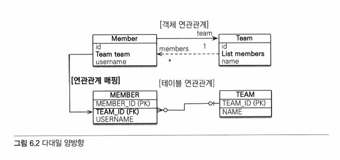
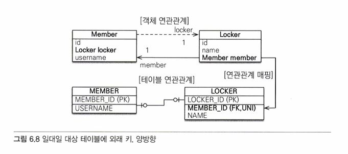

# 06 다양한 연관관계 매핑   
   
- 연관관계를 매핑할 때 고려해야될 3가지 사항   
  - 다중성
    : 다대일(@ManyToOne), 일대다(@OneToMany), 일대일(@OneToOne), 다대다(@ManyToMany)
  - 단방향, 양방향
    : 객체는 참조용 필드를 가지고 있는 객체만 연관된 객체를 조회할 수 있다.   
      객체 관계에서 한 쪽만 참조하는 것을 단방향 관계라 하고, 양쪽이 서로 참조하는 것을 양방향 관계라 한다.
  - 연관관계의 주인
    : JPA는 두 객체 연관관계 중 하나를 정해서 DB 외래키를 관리하는데 이것을 연관관계의 주인이라 한다.
    외래 키를 가진 테이블과 매핑한 엔티티가 외래키를 관리하는 게 효율적이므로 보통 이곳을 연관관계의 주인으로 선택한다. 주인이 아닌 방향은 외래 키를 변경할 수 없고 읽기만 가능하다.
    연관관계의 주인이 아니면 mappedBy 속성을 사용하고 연관관계의 주인 필드 이름을 값으로 입력해야 한다.
   
## 6.1 다대일   
다대일 관계의 반대 방향은 항상 일대다 관계고, 일대다 관계의 반대 방향은 항상 다대일 관계다.
객체 양방향 관계에서 연관관계의 주인은 항상 다쪽이다.   
   
### 6.1.1 다대일 단방향 [N:1]   
   
   
   
   
회원은 Member.team으로 팀 엔티티를 참조할 수 있지만 반대로 팀에는 회원을 참조하는 필드가 없다.   
=> 회원과 팀은 다대일 단방향 연관관계   
   
 @JoinColumn(name = "TEAM_ID")를 사용해서 Member team 필드를 TEAM_ID 외래 키와 매핑했다.   
 => Member.team 필드로 회원 테이블의 TEAM_ID 외래키를 관리   

 ### 6.1.2 다대일 양방향 [N:1, 1:N]   
 다대일 양방향의 객체 연관관계에서 **실선이 연관관계의 주인**(Member.team)이고 점선(Team.members)은 연관관계의 주인이 아니다.   
    

 ```java
@Entity
public class Member {
  @Id @GeneratedValue
  ©Column (name = "MEMBER_ID") 
  private Long id;

  private String username;

  @ManyToOne
  @JoinColumn(name = "TEAM_ID") 
  private Team team;

  public void setTeam(Team team) ( 
    this.team = team;

    // 무한루프에 빠지지 않도록 체크 
    if (!team.getMembers().contains(this)) { 
      team.getMembers().add(this);
    }
}
```
↑ 회원 엔티티   
   
```java
@Entity
public class Team {
  @Id @GeneratedValue 
  @Column(name = "TEAM_ID") 
  private Long id;

  private String name;
  @OneToMany(mappedBy = "team")
  private List<Meinber> members = new ArrayList<Member> () ;

  public void addMember(Member member) { 
    this.members.add(member);

    if (member.getTeam() != this) { //무한루프에 빠지지 않도록 체크 
      member.setTeam(this);
    }
  }
}
```
↑ 팀 엔티티   
   
＊ 양방향은 외래 키가 있는 쪽이 연관관계의 주인이다   
일대다와 다대일 연관관계는 항상 다(N)에 외래 키가 있다.   
위에서는 Member.team이 연관관계의 주인이다.   
JPA는 외래 키를 관리할 때 연관관계의 주인만 사용한다.   
주인이 아닌 Team.members는 조회를 위한 JPQL이나 객체 그래프를 탐색할 때 사용한다.   
   
＊ 양방향 연관관계는 항상 서로를 참조해야 한다   
항상 서로 참조하게 하려면 연관관계 편의 메소드를 작성하는 것이 좋다. (setTeam(), addMember() 메서드가 이런 편의 메서드.   
편의 메서드는 한 곳에만 작성하거나 양쪽 다 작성할 수 있는데, 양쪽에 다 작성하면 무한루프에 빠지므로 주의   
   
## 6.2 일대다   
일대다 고나계는 엔티티를 하나 이상 참조할 수 있으므로 자바 컬렉션인 Collection, List, Set, Map 중에 하나를 사용   
   
### 6.2.1 일대다 단방향 [1:N]   
팀은 회원을 참조하지만, 회원은 팀을 참조하지 않는 것이 단방향 관계.   
   
   
Team.members로 회원 테이블의 TEAM_ID 외래키를 관리하고 있다.   
보통 자신이 매핑한 테이블의 외래키를 관리하는데 ! 이 매핑은 반대쪽 테이블에 있는 외래키를 관리.   
일대다 관계에서 외래 키는 항상 다쪽 테이블에 있다.   
   
```java
@Entity
public class Team {
  @Id @GeneratedValue 
  @Column(name = "TEAM_ID") 
  private Long id;

  private String name;

  @OneToMany
  @JoinColumn (name = "TEAM_ID") // MEMBER 테이블의 TEAM_ID (FK)
  private List<Member> members = new ArrayList<Member>();  

  //Getter, Setter ...
}
```
↑ 일대다 단방향 팀 엔티티   
   
```java
@Entity
public class Member {
  @Id @GeneratedValue
  ©Column (name = "MEMBER_ID") 
  private Long id;

  private String username;

  // Getter, Setter, ...
```
↑ 일대다 단방향 멤버 엔티티  
일대다 관계를 매핑할 때는 @JoinColumn을 명시해야 한다.   
   
＊ 일대다 단방향 매핑의 단점   
매핑한 객체가 관리하는 외래키가 다른 테이블에 있다는 점이다.   
본인 테이블에 외래키가 있으면 엔티티의 저장과 연관관계 처리를 INSERT SQL 한 번으로 끝낼 수 있지만, 다른 테이블에 외래 키가 있으면 연관관계 처리를 위한 UPDATE SQL을 추가로 실행해야 한다.   
   
```java
public void testSave() {
  Member member1 = new Member("member1");
  Member member2 = new Member("member2");

  Team teaml = new Team("teaml"); 
  teaml.getMembers().add(member1); 
  teaml.getMembers().add(member2);

  em.persist(memberl);//INSERT-memberl 
  em.persist(member2);//INSERT—member2
  em.persist(teaml); //INSERT-teaml, UPDATE-memberl.fk, 
                      //UPDATE-member2.fk 
  transaction.commit();
}
```
↑ 일대다 단방향 매핑의 단점   
   
위 testSave를 실행한 결과 SQL은 아래와 같다.   
```
insert into Member (MEMBER_ID, username) values (null, ?) 
insert into Member (MEMBER_ID, username) values (null, ?) 
insert into Team (TEAM_ID, name) values (null, ?) 
update Member set TEAM_ID=? where MEMBER_ID=? 
update Member set TEAM_ID=? where MEMBER_ID=?
```
   
＊ 일대다 단방향 매핑보다는 다대일 양방향 매핑을 사용하자!   
   
### 6.2.2 일대다 양방향 [1:N, N:1]   
일대다 양방향 매핑은 존재하지 않고, **다대일 양방향 매핑**을 사용해야 한다.   
(양방향 매핑에서 @OneToMany는 연관관계의 주인이 될 수 없기 때문)   
일대다 양방향 매핑이 완전히 불가능하진 않긴함.   

   
```java
©Entity
public class Team {
  @Id @GeneratedValue 
  @Column (name = "TEAM_ID") 
  private Long id;

  private String name;

  @OneToMany
  @JoinColumn (name = "TEAM_ID")
  private List<Member> members = new ArrayList<Member>(); 

  //Getter, Setter ...
}
```
↑ 일대다 양방향 팀 엔티티   
   
```java
@Entity
public class Member {
  @Id @GeneratedValue
  ©Column (name = "MEMBER_ID") 
  private Long id;
  private String username;

  @ManyToOne
  @JoinColumn(name = "TEAM_ID", insertable = false, 
              updatable = false)
  private Team team;

  // Getter, Setter, ...
```
↑ 일대다 양방향 회원 엔티티   
   
일대다 단방향 매핑 반대편에 다대일 단방향 매핑을 추가했다.   
이때 일대다 단방향 매핑과 같은 TEAM_ID 외래 키 컬럼을 매핑했다.   
반대편인 다대일 쪽은 insertable = false, updatable = false로 설정해서 읽기만 가능   
   
## 6.3 일대일 [1:1]   
일대일 관계는 양쪽이 서로 하나의 관계만 가진다.   
   
- 일대일 관계의 특징
  - 일대일 관계는 그 반대도 일대일 관계다.
  - 테이블 관계에서 일대다, 다대일은 항상 다(N쪽이 외래 키를 가진다. 반면에 일대일 관계는 주 테이블이나 대상 테이블 둘 중 어느 곳이나 외래 키를 가질 수 있다. 일대일 관계는 주 테이블이나 대상 테이블 중에 누가 외래 키를 가질지 선택해야 한다.
 
＊ 주 테이블에 외래 키   
주 객체가 대상 객체를 참조하는 것처럼 주 테이블에 외래 키를 두고 대상 테이블을 참조한다.   
주 테이블이 외래 키를 가지고 있으므로 주 테이블만 확인해도 대상 테이블과 연관관계가 있는지 알 수 있다.   
   
＊ 대상 테이블에 외래 키   
테이블 관계를 일대일에서 일대다로 변경할 때 테이블 구조를 그대로 유지할 수 있다는 장점이 있다.   
   
### 6.3.1 주 테이블에 외래 키   
주 테이블에 외래 키가 있는 것을 선호한다.   
   
**단방향**   
아래의 그림과 코드를 통해 회원과 사물함의 일대일 단방향 관계를 알아보자.   
   
↑ 일대일 주 테이블에 외래 키, 단방향   
   
```java
@Entity
public class Member {
  @Id @GeneratedValue 
  @Column(name = "MEMBER_ID") 
  private Long id;

  private String username;

  @OneToOne
  @JoinColumn(name = "LOCKER_ID") 
  private Locker locker;
  ...
}

@Entity
public class Locker {
  @Id @GeneratedValue 
  @Column (name = "LOCKER_ID") 
  private Long id;

  private String name;
  ...
}
```
일대일 관계이기 때문에 @OneToOne을 사용했다. DB에는 LOCKER_ID 외래 키에 유니크 제약 조건을 추가했다.   
   
아래는 일대일 양방향 관계   
**양방향**   
   
↑ 일대일 주 테이블에 외래 키, 양방향   

```java
@Entity
public class Member {
  @Id @GeneratedValue 
  @Column (name = "MEMBER_ID") 
  private Long id;

  private String username;

  @OneToOne
  @JoinColumn(name = "LOCKER_ID") 
  private Locker locker;
  ...
}

@Entity
public class Locker {
  @Id @GeneratedValue 
  @Column(name = "LOCKER_ID") 
  private Long id;

  private String name;

  @OneToOne(mappedBy = "locker") 
  private Member member;
...
}
```
양방향이므로 연관관계의 주인을 정해야 한다. MEMBER 테이블이 외래 키를 가지고 있으므로 Member.locker가 연관관계의 주인이다.   
   
### 6.3.2 대상 테이블에 외래 키   
**단방향**   
일대일 관계 중 대상 테이블에 외래 키가 있는 단방향 관계는 JPA에서 지원하지 않는다.   
   
   
   
**양방향**   
대상 테이블에 외래 키가 있는 양방향 관계   
   
   
   
```java
@Entity
public class Member {
  @Id @GeneratedValue 
  @Column (name = "MEMBER_ID") 
  private Long id;

  private String username;

  @OneToOne(mappedBy = "member")
  private Locker locker;
  ...
}

@Entity
public class Locker {
  @Id @GeneratedValue 
  @Column(name = "LOCKER_ID") 
  private Long id;

  private String name;

  @OneToOne
  @JoinColumn(name = "MEMBER_ID")
  private Member member;
```
일대일 매핑에서 대상 테이블에 외래 키를 두고 싶으면 양방향으로 매핑한다.   
   
＋ 프록시를 사용할 때 외래 키를 직접 관리하지 않는 일대일 관계는 지연 로딩으로 설정해도 즉시 로딩된다.   
EX. 위 예제에서 Locker.member는 지연 로딩할 수 있지만, Member.locker는 지연 로딩으로 설정해도 즉시 로딩된다.   
   
## 6.4 다대다 [N:M]   
DB에서 다대다는 표현이 불가하다. => 중간 연결 테이블을 추가해야 한다.   
   
   
   
그런데, 객체는 테이블과 다르게 객체 2개로 다대다 관계를 만들 수 있다. (@ManyToMany 사용)   
   
### 6.4.1 다대다: 단방향   
```java
@Entity
public class Member {
  @Id @Column(name = "MEMBER_ID") 
  private String id;

  private String username;

  @ManyToMany
  @JoinTable(name = "MEMBER_PRODUCT",
              joinColumns = @JoinColumn(name = "MEMBER_ID"), 
              inverseJoinColumns = @JoinColumn(name = "PRODUCT_ID"))

  private List<Product> products = new ArrayList<Product>();
  ...
}
```
↑ 다대다 단방향 회원   
   
```java
@Entity
public class Product {
  @Id @Column(name = "PRODUCT_ID") 
  private String id;

  private String name;
  ...
}
```
↑ 다대다 단방향 상품   
   
@ManyToMany와 @JoinTable을 사용해서 연결 테이블을 바로 매핑함   
=> 회원과 상품을 연결하는 회원_상품(Member_Product) 엔티티 없이 매핑을 완료할 수 있다.   
   
- @JoinTable의 속성을 정리
  - @JoinTable.name: 연결 테이블을 지정한다. 여기서는 MEMBER_PRODUCT 테이블을 선택했다.
  - @JoinTable.joinColumns: 현재 방향인 회원과 매핑할 조인 컬럼 정보를 지정한다. MEMBER_ID로 지정했다.
  - @JoinTable.inverseJoinColumns: 반대방향인 상품과 매핑할 조인 컬럼 정보를 지정한다. PRODUCT_ID로 지정했다.

MEMBER_PRODUCT 테이블은 다대다 관계를 일대다, 다대일 관계로 풀어내기 위해 필요한 연결 테이블일 뿐이다.   
@ManyToMany로 매핑한 덕분에 다대다 관계를 사용할 때는 이 연결 테이블을 신경 쓰지 않아도 된다.   
   
```java
public void save() {
  Product productA = new Product(); 
  productA.setId("productA"); 
  productA.setName ("상품A"); 
  em.persist(productA);

  Member member1 = new Member(); 
  member1.setld("memberl"); 
  member1.setUsername("회원1");
  member1.getProducts().add(productA) //연관관계 설정 
  em.persist(memberl);
}
```
위 코드를 실행하면 다음과 같은 sql이 실행된다.   
   
 INSERT INTO PRODUCT ...   
 INSERT INTO MEMBER ...   
 INSERT INTO MEMBER PRODUCT ...   
   
```java
public void find () {
  Member member = em.find (Member.class, "memberl");
  List<Product> products = member.getProducts(); // 객체 그래프 탐색 

  for (Product product : products) {
     System.out.prrintln("product.name = " + product.getName());
  }
}
```
저장 후에 조회하기 위해 위 코드를 실행했을 때의 실행 SQL은 아래와 같다.   
   
SELECT * FROM MEMBER_PRODUCT MP   
INNER JOIN PRODUCT P ON MP.PRODUCT_ID=P.PRODUCT_ID   
WHERE MP.MEMBER ID=?   
   
@ManyToMany를 사용해서, 연결 테이블인 MEMBER_PRODUCT와 상품 테이블을 조회해오고 있다.   
   
### 6.4.2 다대다: 양방향   
역방향도 @ManyToMany를 사용한다. 그리고 원하는 곳에 mappedBy로 연관관계의 주인을 지정한다.   
```java
@Entity
public class Product {
  @Id
  private String id;

  @ManyToMany (mappedBy = "products") // 역방향 추가
  private List<Meinber> members;
...
}
```
다대다의 양방향 연관관계는 다음처럼 설정하면 된다.   
   
```java
member.getProducts().add(product); 
product.getMembers().add(member);
```
   
양방향 연관관계는 연관관계 편의 메서드를 추가해서 관리하는 것이 편리하다.   
```java
public void addProduct(Product product) {
  products.add(product) ; 
  product.getMembers().add(this);
}
```
양방향 연관관계로 만들었으므로 product.getMembers()를 사용해서 역방향으로 객체 그래프를 탐색할 수 있다.   
   
```java
public void findlnverse () {
  Product product = em.find (Product.class, "productA") ; 
  List<Member> members = product.getMembers(); 

  for (Member member : members) {
   System.out.println("member = " + member.getUsername());
  }
}
```
   
### 6.4.3 다대다: 매핑의 한계와 극복, 연결 엔티티 사용   
@ManyToMany를 사용하면 연결 테이블을 자동으로 처리해주므로 도메인 모델이 단순해지고 여러 가지로 편리하다.   
but 실무에서 사용하기에는 한계가 있다.   
   
   
연결 테이블에 주문수량, 주문 날짜 컬럼을 추가.   
-> @ManyToMany를 사용할 수 없다.   
∵ 주문 엔티티나 상품 엔티티에는 추가한 컬럼들을 매핑할 수 없기 때문   
   
   
-> 연결 테이블을 매핑하는 연결 엔티티를 만들고, 추가한 컬럼들을 매핑해야 한다.   
   
```java
@Entity
public class Member {
  @Id @Column (name = "MEMBER_ID") 
  private String id;

  //역방향
  @OneToMany (mappedBy = "member")
  private List<MemberProduct> memberProducts;
...
}
```
회원과 회원 상품을 양방향 관계로 만들었다. 회원상품 엔티티 쪽이 외래키를 가지고 있으므로 연관관계의 주인이다.   
   
```java
@Entity
public class Product {
  @Id @Column(name = "PRODUCT_ID") 
  private String id;

  private String name;

  ...
}
```
상품 엔티티에서 회원상품 엔티티로 객체 그래프 탐색 기능이 필요하지 않다고 판단해서 연관관계 x   
   
```java
@Entity
@IdClass(MemberProductld.class)
public class MemberProduct {
  @Id
  @ManyToOne
  @JoinColumn(name = "MEMBER_ID")
  private Member member; // MemberProductld.member와 연결 

  @Id
  @ManyToOne
  @JoinColumn(name = "PRODUCT_ID")
  private Product product; // MemberProductld.product와 연결 

  private int orderAmount;
...
}
```
↑ 회원상품 엔티티 코드   
   
```java
public class MemberProductld implements Serializable {
  private String member; // MemberProduct.member와 연결 
  private String product; // MemberProduct.product와 연결

  //hashCode and equals

  @Override
  public boolean equals(Object o) {...}

  @Override
  public int hashCode() {...}
}
```
↑ 회원상품 식별자 클래스   
   
회원상품 엔티티를 보면 기본 키를 매핑하는 @Id와 외래키를 매핑하는 @JoinColumn을 동시에 사용해서 기본키 + 외래키를 한 번에 매핑   
그리고 @IdClass를 사용해서 복합 기본 키를 매핑했다.   
   
＊ 복합 기본 키   
JPA에서 복합키를 사용하려면 별도의 식별자 클래스를 만들어야 한다. 그리고 엔티티에 @IdClass를 사용해서 식별자 클래스를 지정하면 된다.   
   
- 복합 키를 위한 식별자 클래스의 특징
  - 복합 키는 별도의 식별자 클래스로 만들어야 한다.
  - Serializable을 구현해야 한다.
  - equals와 hashCode 메서드를 구현해야 한다.
  - 기본 생성자가 있어야 한다.
  - 식별자 클래스는 public 이어야 한다.
  - @IdClass를 사용하는 방법 외에 @EmbeddedId를 사용하는 방법도 있다.
    
＊ 식별 관계   
부모 테이블의 기본 키를 받아서 자신의 기본 키 + 외래 키로 사용하는 것을 말한다.   
   
   
회원상품 엔티티는 데이터베이스에 저장될 때 연관된 회원의 식별자와 상품의 식별자를 가져와서 자신의 기본 키 값으로 사용한다.   

   
복합키는 항상 식별자 클래스를 만들어야 한다.   
   
### 6.4.4 다대다: 새로운 기본 키 사용   
추천하는 기본 키 생성 전략은 db에서 자동으로 생성해주는 대리 키를 Long 값으로 사용하는 것이다.   
∵ 간편하고, 거의 영구히 쓸 수 있으며 비즈니스 의존x   
   
이번에는 연결 테이블에 새로운 기본 키 사용   
   
   
   
   
대리키를 사용함으로써 매핑이 단순하고 이해하기 쉽다. 회원 엔티티와 상품 엔티티는 변경사항x   
저장 코드도 변경사항x, 조회 코드는 아래처럼 변경되었다.   

   
식별자 클래스를 사용하지 않아서 한결 단순해졌다.   

### 6.4.5 다대다 연관관계 정리   
다대다 관계를 일대다 다대일 관계로 풀어내기 위해 연결 테이블을 만들 때 식별자를 어떻게 구성할지 선택해야 한다.   
- 식별관계: 받아온 식별자를 기본키 + 외래키로 사용한다.
- 비식별관계: 받아온 식별자는 외래키로만 사용하고 새로운 식별자를 추가한다.
   
