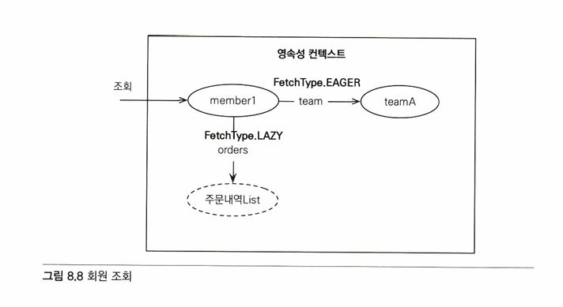

# 08 프록시와 연관관계 관리   
## 8.1 프록시   

   
   
예제 8.3의 printUserAneTeam() 메서드는 memberId로 회원 엔티티를 찾아서 회원과, 팀의 이름을 출력한다.   
반면에 예제 8.4의 printUser() 메서드는 회원 엔티티만 출력을 하고, 회원과 연관된 팀 엔티티는 전혀 사용하지 않는다.   
이렇게 em.find()로 회원 엔티티를 조회할 때 회원과 관련된 팀 엔티티(Member.team)까지 DB에서 함꼐 조회해 두는 것은 효율적이지 않다.   
   
**지연로딩**: JPA에서 제공하는 엔티티가 실제 사용될 때까지 DB 조회를 지연하는 방법   
EX. team.getName()처럼 팀 엔티티의 값을 실제 사용하는 시점에 DB에서 팀 엔티티에 필요한 데이터를 조회하는 것.   
＊ 지연로딩 기능을 사용하려면, 실제 엔티티 객체 대신에 DB 조회를 지연할 수 있는 가짜 객체가 필요 => **프록시 객체**   
   
### 8.1.1 프록시 기초   
JPA에서 식별자로 엔티티 하나를 조회할 때에는 EntityManager.find()를 사용한다.   
이 메서드는 영속성 컨텔스트에 엔티티가 없으면 DB를 조회   
   
```java
Member member = em.find(Member.class, "member1");
```
이렇게 엔티티를 직접 조회하면 조회한 엔티티의 실 사용여부와 상관 없이 DB를 조회한다.   
   
엔티티를 실제 사용하는 시점까지 DB 조회를 미루고 싶으면 EntityManager.getReference() 메서드를 사용   
```java
Member member = em.getReference(Member.class, "member1");
```
위 메서드를 호출하면, JPA는 DB 조회X, 실제 엔티티 객체 생성X   
=> 대신에 DB 접근을 위임한 프록시 객체 반환   
   
   
   
－ 프록시의 특징   
   
프록시는 실제 클래스를 상속 받아서 만들어짐 -> 실제 클래스와 겉모양이 같다.   
   
   
프록시 객체는 실제 객체에 대한 참조를 보관한다.   
그리고 프록시 객체의 메서드를 호출하면, 프록시 객체는 실제 객체의 메서드를 호출한다.   
   
＊ 프록시 객체의 초기화   
프록시 객체의 초기화: member.getName()처럼 실제 사용될 때 DB를 조회해서 실제 엔티티 객체를 생성하는 것   
   
   
   
   
－ 프록시 초기화 과정   
1. 프록시 객체에 member.getName()을 호출해서 실제 데이터를 조회한다.
2. 프록시 객체는 실제 엔티티가 생성되어 있지 않으면 영속성 컨텍스트에 실제 엔티티 생성을 요청 -> "초기화"
3. 영속성 컨텍스트는 DB를 조회해서 실제 엔티티 객체를 생성
4. 프록시 객체는 생성된 실제 엔티티 객체의 참조를 Mmeber target 멤버변수에 보관
5. 프록시 객체는 엔티티 객체의 getName()을 호출해서 결과 반환
   
＊ 프록시의 특징   
- 프록시 객체는 처음 사용할 때 한 번만 초기화된다
- 프록시 객체를 초기화한다고 프록시 객체가 실제 엔티티로 바뀌는 것은 아니다. 프록시 객체가 초기화되면 프록시 객체를 통해서 실제 엔티티에 접근할 수 있다.
- 프록시 객체는 원본 엔티티를 상속받은 객체이므로 타입 체크 시에 주의해서 사용해야 한다.
- 영속성 컨텍스트에 찾는 엔티티가 이미 있으면 DB를 조회할 필요가 없으므로 em.getReference()를 호출해도 프록시가 아닌 실제 엔티티를 반환한다.
- 초기화는 영속성 컨텍스트의 도움을 받아야 가능하다. 따라서 영속성 컨텍스트의 도움을 받을 수 없는 준영속 상태의 프록시를 초기화하면 문제가 발생한다. 하이버네이트는 org.hibernate.LazyInitializationException 예외를 발생시킨다.
   
＊ 준영속 상태와 초기화   
```java
// MemberProxy 반환
Mmeber member = em.getReference(Member.class, "id1");
transaction.commit;
em.close(); // 영속성 컨텍스트 종료

member.getName(); // 준영속 상태 초기화 시도,
// org.hibernate.LazyInitializationException 예외를 발생
```
em.close() 메서드로 member를 준영속 상태로 만드는데, member.getName()을 호출하면 프록시를 초기화해야 하는데, 영속성 컨텍스트가 없기 때문에 실제 엔티티 조회가 불가 -> 예외 발생   
   
### 8.1.2 프록시와 식별자   
엔티티를 프록시로 조회할 때 식별자 값을 파라미터로 전달하고, 프록시 객체는 이 식별자 값을 보관한다.   
```java
Team team = em.getReference(Team.class, "team1"); // 식별자 보관
team.getId(); // 초기화되지않음
```
프록시 객체는 식별자 값을 가지고 있으므로 식별자 값을 조회하는 team.getId()를 호출해도 프록시를 초기화 X   
   
```java
Member member = em.find(Member.class, "member1");
Team team = em.getReference(Team.class, "team1"); // SQL을 실행하지 않음
team.setTeam(team);
```
연관관계를 설정할 때는 식별자 값만 사용하므로 프록시를 사용하면 DB 접근 횟수를 줄일 수 있다.
??????????????
   
### 8.1.3 프록시 확인   
JPA가 제공하는 PersistenceUnitUtil.isLoaded(Object entity) 메서드를 사용하면 프록시 인스턴스의 초기화 여부를 확인할 수 있다.   
false: 초기화 x   
true: 초기화 되었거나 프록시 인스턴스가 아닌 경우   
   
```java
 boolean isLoad = em.getEntityManagerFactory().getPersistenceUnitUtil().isLoaded(entity);
 / / 또 는 boolean isLoad = emf.getPersistenceUnitUtil().isLoaded(entity);
```
   
조회한 엔티티가 진짜 엔티티인지 프록시로 조회한 것인지 확인하려면 클래스명을 직접 출력한다.   
```java
System. out.println ("memberProxy = " + member.getClass().getName ()) ;
 //결과: memberProxy = jpabook.domain.Member_$$_javassist_0
```
클래스 명 뒤에 ..javassist..라 되어 있는 것을 보아 프록시인 것을 확인할 수 있다.   
   
** 8.2 즉시 로딩과 지연 로딩   
프록시 객체는 주로 연관된 엔티티를 지연 로딩할 때 사용한다.   
   
```java
Member member = em.find (Member.class, "memberl") ;
Team team = member.getTeam () ; // 객체 그래프 탐색 
System.out.println (team.getName()); // 팀 엔티티 사용
```
   
- 즉시로딩: 엔티티를 조회할 때 연관된 클래스 함께 조회
  - ex. em.find(Member.class, "member")를 호출할 때 회원 엔티티와 연관된 팀 엔티티 함께 조회
  - 설정 방법: @ManyToOne(fetch = FetchType.EAGER)
- 지연로딩: 연관된 엔티티를 실제 사용할 떄 조회한다.
  - ex. member.getTeam().getName()처럼 조회한 팀 엔티티를 실제 사용하는 시점에 JPA가 SQL을 호출해서 팀 엔티티를 조회한다.
  - 설정 방법: @ManyToOne(fetch = FetchType.LAZY)
   
### 8.2.1 즉시 로딩   
즉시로딩을 사용하면, 조인 쿼리를 사용해서 두 엔티티를 모두 조회한다.   
   
   
이후 member.getTeam()을 호출하면 이미 로딩된 팀1 엔티티를 반환한다.   

＋ JPA는 선택적 관계면 외부 조인을 사용하고, 필수 관계는 내부 조인을 사용한다.   
   
내부 조인을 사용할 수 있는 방법은 nullable, optional 속성 설정이 있다.   
   
1. nullable 설정
 - @JoinColumn(nullable = true): NULL 허용(기본값), 외부 조인 사용
 - @JoinColumn(nullable = false): NULL 허용하지 않음. 내부 조인 사용   
2. optional 설정
 - @ManyToOne(fetch = FetchType.EAGER, optional = false)
   
### 8.2.2 지연로딩   
지연로딩을 사용하려면 @ManyToOne의 fetch 속성을 FetchType.LAZY로 설정한다.   
   
em.find(Mmeber.class, "member1")을 호출하면 회원만 조회하고, 팀 조회x   
대신에 회원의 team 멤버변수에 프록시 객체를 넣는다.   
```
Team team = member.getTeam(); // 프록시 객체
```
반환된 팀 객체는 프록시 객체다. 이 프록시 객체는 실제 사용될 때까지 데이터 로딩을 미룬다.   
```java
team.getName(); // 팀 객체 실제 사용
```
위처럼 실제 데이터가 필요한 순간이 되어서야 DB를 조회해서 프록시 객체를 초기화한다.   
   
＋ team1 엔티티가 영속성 컨텍스트에 로딩되어 있으면 프록시가 아닌 실제 team1 엔티티를 사용한다.   
   
### 8.2.3 즉시 로딩, 지연 로딩 정리   
연관된 엔티티를 즉시 로딩하는 것이 좋은지 아니면 실제 사용할 때까지 지연해서 로딩하는 것이 좋은지는 상황에 따라 다르다.   
   
- 지연로딩(LAZY): 연관된 엔티티를 프록시로 조회한다. 프록시를 실제 사용할 때 초기화하면서 DB를 조회한다.
- 즉시로딩(EAGER): 연관된 엔티티를 즉시 조회한다. 하이버네이트는 가능하면 SQL 조인을 사용해서 한 번에 조회한다.
   
## 8.3 지연 로딩 활용   
### 8.3.1 프록시와 컬렉션 래퍼   
   
즉시로딩한 teamA는 실선으로 표현했고 지연로딩한 주문내역은 점선으로 표시했다. 지연로딩으로 설정하면 실제 엔티티 대신에 프록시 객체를 사용한다.   
   
### 8.3.2 JPA 기본 페치 전략   
fetch 속성의 기본 설정값은 다음과 같다.   
- @ManyToOne, @OneToOne: 즉시 로딩(FetchType.EAGER)
- @OneToMany, @ManyToMany: 지연 로딩(FetchType.LAZY)
   
연관된 엔티티가 하나면 즉시 로딩을, 컬렉션이면 지연 로딩을 사용한다.   
∵ 컬렉션을 로딩하는 것은 비용이 많이 들고 잘못하면 너무 많은 데이터를 로딩할 수 있기 때문이다.   
   
추천하는 방법은 모든 연관관계에 지연 로딩을 사용하는 것이다. 그리고 애플리케이션 개발이 어느 정도 완료단계에 왔을 때 실제 사용하는 상황을 보고 꼭 필요한 곳에만 즉시 로딩을 사용하도록 최적화하면 된다.   
   
### 8.3.3 컬렉션에 FetchType.EAGER 사용 시 주의점   
- 컬렉션을 하나 이상 즉시 로딩하는 것은 권장X
- 컬렉션 즉시 로딩은 항상 외부 조인을 사용한다.

－ FetchType.EAGER 설정과 조인 전략   
- @ManyToOne, @OneToOne
  - (optional = false): 내부조인
  - (optional = true): 외부조인
- @OneToMany, @ManyToMany
  - (optional = false): 외부조인
  - (optional = true): 외부조인
   
## 8.4 영속성 전이: CASCADE   
특정 엔티티를 영속 상태로 만들 때 연관된 엔티티도 함꼐 영속 상태도 만들고 싶으면 영속성 전이를 사용하면 된다.   
   
   
   
```java
private static void saveNoCascade(EntityManager em) { 
// 부모 저장
Parent parent = new Parent(); 
em.persist(parent) ;

// 1번 자식 저장
Child childl = new Child();
childl.setParent (parent); // 자식 -> 부모 연관관계 설정 
parent.getChildren ().add(childl); // 부모 -> 자식
em.persist (childl) ;

// 2번 자식 저장
Child child2 = new Child();
child2.setParent (parent); // 자식 -> 부모 연관관계 설정 
parent.getChildren().add(child2); // 부모 -> 자식 
em.persist (child2);
}
```
↑ 한 명의 부모에 자식 2명을 저장하는 코드   
   
JPA에서 엔티티를 저장할 때 연관된 모든 엔티티는 영속 상태여야 한다.   
=> 부모, 자식 엔티티 각각 영속 상태로 만든다.   
=>> 영속성 전이를 사용하면 부모만 영속상태로 만들었을 때 연관된 자식까지 한 번에 영속상태로 만들 수 있다.   
   
### 8.4.2 영속성 전이: 저장   
```java
 @Entity
 public class Parent {
 @OneTcMany (mappedBy = "parent", cascade = CascadeType.PERSIST)
 private List<Child> children = new ArrayList<Child>();
```
**cascade = CascadeType.PERSIST** 옵션 설정   
   

   
부모만 영속화하면 CascadeType.PERSIST로 설정한 자식 엔티티까지 함꼐 영속화해서 저장한다.   

### 8.4.2 영속성 전이: 삭제   
저장한 부모와 자식 엔티티를 모두 제거하려면 각각의 엔티티를 하나씩 제거해야 한다.   
```java
Parent findParent = em.find(Parent.class, 1L);
Child findChildl = em.find(Child.class, 1L) ;
Child findChild2 = em.find(Child.class, 2L) ;
em. remove (findChildl); 
em. remove (findChild2) ; 
em. remove (findParent) 
```
영속성 전이는 CascadeType.REMOVE로 설정한 후, 부모 엔티티만 삭제하면 연관된 자식 엔티티도 함께 삭제된다.   
   
```java
Parent findParent = em.find(Parent.class, 1L); 
em.remove (findParent);
```
코드를 실행하면 DELETE SQL을 3번 실행하고 부모는 물론 연관된 자식도 모두 삭제한다.   
삭제 순서는 외래 키 제약조건을 고려해서 자식을 먼저 삭제하고 부모를 삭제한다.   
   
＊ 부모만 삭제하면 DB 외래키 무결성 예외가 발생하니 주의 필요   
   
### 8.4.3 CASCADE의 종류   
   
CascadeType 코드에는 다양한 옵션이 있다.   
   
**CasecadeType.PERSIST, CascadeType.REMOVE는 em.persist(), em.remove()를 실행할 때 바로 전이x, 플러시를 호출할 떄 전이 발생**   
   
## 8.5 고아 객체   
고아객체 제거: 부모 엔티티와 연관관계가 끊어진 자식 엔티티를 자동으로 삭제하는 기능   
부모 엔티티의 컬렉션에서 자식 엔티티의 참조만 제거하면 자식 엔티티가 자동으로 삭제된다.   
   
```java
@Entity
public class Parent {
  @Id @GeneratedValue
  private Long id;

  @OneToMany(mappedBy = "parent”, orphanRemoval = true)
  private List<Child> children = new ArrayList<Child>();
...
}
```
고아객체 제거 기능을 활성화하기 위해 컬렉션에 orphanRemoval = true를 설정한다.   
   
```java
Parent parentl = em.find(Parent.class, id) ;
parentl.getChildren ().remove(0); // 자식 엔티티를 컬렉션에서 제거
```
실행 SQL은 아래와 같다.   
```SQL
DELETE FROM CHILD WHERE ID = ?
```
orphanRemoval 옵션으로 인해 컬렉션에서 엔티티를 제거하면 DB의 데이터도 삭제된다.   
   
모든 자식 엔티티를 제거하려면 다음 코드처럼 컬렉션을 비우면 된다.   
```java
parent1.getChildren().clear();
```
   
고아 객체 제거: 참조가 제거된 엔티티는 다른 곳에서 참조하지 않는 고아 객체로 보고 삭제하는 기능이다.   
=> 참조하는 곳이 하나일 때에만 사용해야 한다. (@OneToOne, @OneToMany에만 사용 가능)   
   
## 8.6 영속성 전이 + 고아 객체, 생명주기   
CasecadeType.ALL + orphanRemoval = true를 동시에 사용한다면?   

```java
// 등록(CASCADE)
Parent parent = em.find(Parent.class, parentId);
parent.addChild(child);

// 삭제(orphanRemoval)
Parent parent = em.find(Parent.class, parentId);
parent.getChildren().remove(removeObject);
```
   
## 8.7 정리   
- JPA 구현체들은 객체 그래프를 마음껏 탐색할 수 있도록 지원하는데 이때 프록시 기술을 사용한다.
- 객체를 조회할 때 연관된 객체를 즉시 로딩하는 방법을 즉시 로딩이라 하고, 연관된 객체를 지연해서 로딩하는 방법을 지연 로딩이라 한다.
- 객체를 저장하거나 삭제할 때 연관된 객체도 함꼐 저장하거나 삭제할 수 있는데 이것을 영속성 전이라 한다.
- 부모 엔티티와 연관관계가 끊어진 자식 엔티티를 자동으로 삭제하려면 고아 객체 제거 기능을 사용하면 된다.
