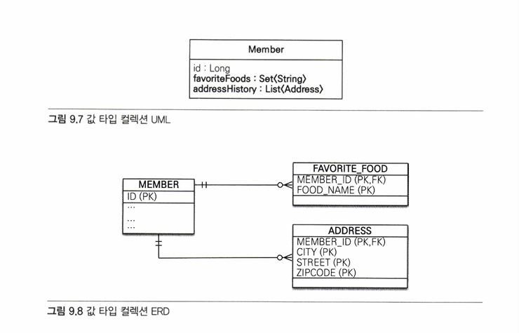

## 9.5 값 타입 컬렉션   
값 타입을 하나 이상 저장하려면 컬렉션에 보관하고 @ElementCollection, @CollectionTable 어노테이션을 사용하면 된다.   
```java
@Entity
public class Member {
  @Id @GeneratedValue 
  private Long id;

  @Embedded
  private Address homeAddress;

  @ElementCollection
  @CollectionTable(name = "FAVORITE_FOODS",
      joinColumns = @JoinColumn(name = "MEMBER_ID"))
  @Column (name="FOOD_NAME")
  private Set<String> favoriteFoods = new HashSet<String>();

  @ElementCollection
  @CollectionTable (name = "ADDRESS", joinColumns 
    = @ JoinColumn (name = "MEMBER_ID")) 
  private List<Address> addressHistory = new ArrayList<Address>(); 
  // ...
}

@Embeddable
public class Address {
  @Column
  private String city; 
  private String street; 
  private String zipcode;
  // ...
}
```
[↑ 값 타입 컬렉션]   
   
   
   
favoriteFoods는 기본값 타입인 String을 컬렉션으로 가진다.   
별도의 테이블을 추가하고 @CollectionTable을 사용해서 추가한 테이블을 매핑해야 한다.   
   
addressHistory는 임베디드 타입인 Address 컬렉션으로 가진다. 마찬가지로 별도의 테이블을 사용
   
## 9.6 정리   
- 엔티티 타입의 특징
  - 식별자(@id)가 있다.
    - 엔티티 타입은 식별자가 있고 식별자로 구별할 수 있다.
  - 생명주기가 있다.
    - 생성하고, 영속화하고, 소멸하는 생명 주기가 있다.
    - em.persist(entity)로 영속화한다.
    - em.remove(entity)로 제거한다.
  - 공유할 수 있다.
    - 참조 값을 공유할 수 있다. 이것을 공유 참조라 한다.
    - 예를 들어 회원 엔티티가 있다면 다른 엔티티에서 얼마든지 회원 엔티티를 참조할 수 있다.
   
- 값 타입의 특징
  - 식별자가 없다.
  - 생명 주기를 엔티티에 의존한다.
    - 스스로 생명 주기를 가지지 않고 엔티티에 의존한다. 의존하는 엔티티를 제거하면 같이 제거된다.
  - 공유하지 않는 것이 안전하다.
    - 엔티티 타입과는 다르게 공유하지 않는 것이 안전하다. 대신에 값을 복사해서 사용해야 한다.
    - 오직 하나의 주인만이 관리해야 한다.
    - 불변 객체로 만드는 것이 안전하다.
      
  식별자가 필요하고 지속해서 값을 추적하고 구분하고 변경해야 한다면 그것은 값 타입이 아니라 엔티티다.
