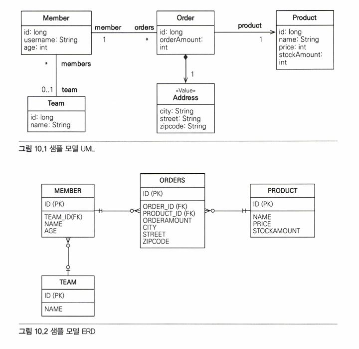

# 10 객체지향 쿼리 언어   
JPA는 복잡한 검색 조건을 사용해서 엔티티 객체를 조회할 수 있는 다양한 쿼리 기술을 지원한다.   

## 10.1 객체지향 쿼리 소개   
- 엔티티의 단순한 검색 방법
  - 식별자로 조회 EntityManager.find()
  - 객체 그래프 탐색 (ex. a.getB().getC())
   
but 너무 단순해서 복잡한 검색이 불가능   
-> JPQL이 생김   
   
- JPQL(Java Persistence Query Language)의 특징
  - 테이블이 아닌 객체를 대상으로 검색하는 객체지향 쿼리
  - SQL을 추상화해서 특정 데이터베이스 SQL에 의존X
   
JPA: 엔티티 객체를 대상으로 하는 객체지향 쿼리로, JPA가 JPQL을 분석한 다음 적절한 SQL을 만들어서 DB를 조회, 조회 결과로 엔티티 객체를 생성해서 반환   
   
- JPA가 공식 지원하는 검색 기능
  - JPQL
  - Criteria 쿼리: JPQL을 편하게 작성하도록 도화주는 API, 빌더 클래스 모음
  - 네이티브 SQL: JPA에서 JPQL 대신 직접 SQL을 사용
   
- JPA가 공식 지원X, 알아두면 좋은 검색 기능
  - QueryDSL: Criteria 쿼리처럼 JPQL을 편하게 작성하도록 도와주는 빌더 클래스 모음, 비표준 오픈소스 프레임워크
  - JDBC 직접 사용, MyBatis 같은 SQL 매퍼 프레임워크 사용: 필요하면 JDBC를 직접 사용할 수 있다.
   
### 10.1.1 JPQL 소개   
JPQL은 엔티티 객체를 조회하는 객체지향 쿼리다. 문법은 SQL과 비슷하고 ANSI 표준 SQL이 제공하는 기능을 유사하게 지원   
JPQL은 SQL을 추상화해서 특정 DB에 의존하지 않는다.   
DB 방언만 변경하면 JPQL을 수정하지 않아도 자연스럽게 DB를 변경할 수 있다.   
(EX. 같은 SQL 함수라도 DB마다 사용 문법이 다른 것이 있는데, JPQL이 제공하는 표준화된 함수를 사용하면 선택한 방언에 따라 해당 DB에 맞춘 적절한 SQL 함수가 실행된다.)   
   
JPQL은 엔티티 직접 조회, 묵시적 조인, 다형성 지원으로 SQL보다 코드가 간결하다.   
   
```java
@Entity (name="Member") //name 속성의 기본값은 클래스 명 
public class Member {
  @Column (name = "name") 
  private String username; 
  //...
}
```
[↑ 회원 엔티티]   
```java
// 쿼리 생성
String jpql = "select m from Member as m where m.username = 'kim'"; 
List<Member> resultList =
  em.createQuery(jpql, Member.class).getResultList();
```
[↑ JPQL 사용]   
   
회원이름이 kim인 엔티티를 조회.   
m.username은 엔티티 객체의 필드명이다.   
   
1. em.createQuery() 메서드에 실행할 JPQL과 반환할 엔티티의 클래스 타입을 넘기고
2. getResultList() 메서드들 실행하면
3. JPA는 JPQL을 SQL로 변관해서 DB를 조회,
4. Member 엔티티를 생성해서 반환
   
```
select m
from Member as m 
where m.username = 'kim'
```
   
```sql
 select
  member.id as id, 
  member.age as age, 
  member.team_id as team, 
  member.name as name
from
  Member member 
where
  member.name= 'kim'
```
   
### 10.1.2 Criteria 쿼리 소개   
Criteria: JPQL을 생성하는 빌더 클래스   
장점: 문자가 아닌 query.select(m).where(...)처럼 프로그래밍 코드로 JPQL을 작성할 수 있다는 것   
   
- 문자로 작성한 JPQL보다 코드로 작성한 Criteria의 장점
  - 컴파일 시점에 오류를 발견할 수 있다.
  - IDE를 사용하면 코드 자동완성을 지원한다.
  - 동적 쿼리를 작성하기 편하다.
   
```java
// Criteria 사용 준비
CriteriaBuilder cb = em.getCriteriaBuilder(); 
CriteriaQuery<Member> query = cb.createQuery(Member.class);

// 루트 클래스 (조회를 시작할 클래스)
Root<Member> m = query.from(Member.class);

//쿼리 생성
CriteriaQuery<Member> cq =
 query.select (m).where(cb.equal(m.get("username"), "kim")); 
List<Member> resultList = em.createQuery(cq).getResultList();
```
Criteria는 동적 쿼리를 작성할 때 유리하기도 함   
but 복잡하고 장황 -> 사용 불편, 코드도 한 눈에 들어오지 X 단점 존재   
   
### 10.1.3 QueryDSL 소개   
Criteria처럼 JPQL 빌더 역할을 한다.   
＋ 코드 기반이면서 단순하고 사용하기 쉽다.   
＋ JPQL과 코드가 비슷해서 한 눈에 들어온다.   
   
```java
// 준비
JPAQuery query = new JPAQuery(em); 
QMember member = QMember.member;

// 쿼리, 결과조회 
List<Member> members = 
  query.from(member)
   .where(member.username.eq("kim")) 
  .list(member);
```
[↑ QueryDSL 코드]   
QueryDSL도 어노테이션 프로세서를 사용해서 쿼리 전용 클래스를 만들어야 한다.   
여기에서 QMember가 엔티티 클래스 기반으로 생성한 QueryDSL 쿼리 전용 클래스   
   
### 10.1.4 네이티브 SQL 소개   
SQL을 직접 사용할 수 있는 기능   
   
가끔은 특정 DB에 의존하는 기능을 사용해야 할 때가 있다.   
이럴 때 사용하는데, 네이티브 SQL의 단점은 특정 DB에 의존하는 SQL을 작성해야해서,   
데이터베이스를 변경하면 네이티브 SQL도 수정해야 한다.   
   
```java
 String sql = "SELECT ID, AGE, TEMI_ID, NAME FROM MEMBER WHERE NAME = 'kim'";
 List<Member> resultList = em.createNativeQuery(sql, Member.class).getResultList();
```
[↑ 네이티브 SQL]   
   
### 10.1.5 JDBC 직접 사용, 마이바티스 같은 SQL 매퍼 프레임워크 사용   
JDBC 커넥션에 직접 접근하고 싶으면 JPA는 JDBC 커넥션을 획득하는 API를 제공 X   
-> JPA 구현체가 제공하는 방법 사용   
   
```java
Session session = entityManager.unwrap(Session.class); 
session.doWork(new Work() {

  @Override
  public void execute(Connection connection) throws SQLException { 
  //work...
   }
 });
```
1. JPA EntityManager에서 하이버네이트 Session을 구한다.
2. Session의 doWork() 메서드를 호출한다.
   
＊JDBC나 마이바티스를 JPA와 함께 사용하면 영속성 컨텍스트를 적절한 시점에 강제로 플러시 해야 한다.   
위 방법은 JPA를 우회해서 데이터베이스에 접근을 하는데, JPA는 우회해서 접근하는 SQL을 인식X   
-> 영속성컨텍스트와 DB를 불일치 상태로 만들어 데이터의 무결성이 훼손될 수도 있다.   
   
**JPA를 우회해서 SQL을 실행하기 직전에 영속성 컨텍스트를 수동으로 플러시해서 DB와 영속성 컨텍스트를 동기화하면 된다.**   
스프링 프레임워크의 AOP를 적절히 활용해서 JPA를 우회해, DB에 접근하는 메서드를 호출할 때마다 영속성 컨텍스트를 플러시 하면 된다.   
   
## 10.2 JPQL   
- JPQL의 특징
   - JPQL은 객체지향 쿼리 언어이다. ∴ 테이블 대상X, 엔티티 객체를 대상
   - JPQL은 SQL을 추상화해서 특정 DB SQL에 의존X
   - JPQL은 결국 SQL로 변환된다.
   
   
회원이 상품을 주문하는 다대다 관계   
   
### 10.2.1 기본 문법과 쿼리 API   
JPQL도 SQL과 비슷하게 SELECT, UPDATE, DELETE문 사용 가능   
엔티티 저장 시에는 EntityManager.persist() 메서드들 사용하면 되기에 INSERT문은 X   
   
```java
select_문 :: = 
  select_절 
  from 절 
  [where_ 절]
  [groupby_절]
  [having_절]
  [orderby_절]

update_문 :: = update_절 [where_절] 
delete_문 :: = delete_절 [where_절]
```
   
#### SELECT 문   
```java
 SELECT m FROM Member AS m where m.username = 'Hello'
```
   
－ 대소문자 구분   
엔티티와 속성은 대소문자를 구분한다.(ex. Member, username)   
SELECT, FROM, AS 같은 JPQL 키워드는 대소문자 구분X   
   
－ 엔티티 이름   
클래스 명이 아니라 엔티티 명을 사용한다. @Entity(name = "XXX")로 지정하지 않았으면, 클래스명을 기본값으로 사용   
   
－ 별칭은 필수   
Member AS m을 보면 Member에 m이라는 별칭을 주었다. (AS는 생략 가능)   
   
#### TypeQuery, Query   
작성한 JPQL을 실행하려면 쿼리 객체를 만들어야 한다.   
   
- TypeQuery: 반환할 타입을 명확하게 지정할 수 있을 때 사용
- Query: 반환 타입을 명확하게 지정할 수 없을 때 사용
   
```java
TypedQuery<Member> query =
  em.createQuery ("SELECT m FROM Member m", Member.class);

List<Member> resultList = query.getResultList(); 
for (Member member : resultList) {
 System.out.println("member = ” + member);
}
```
[↑ TypeQuery 사용]   
em.createQuery()의 두 번째 파라미터에 반환할 타입을 지정 -> TypeQuery 반환, 지정x -> Query 반환   
   
```java
Query query =
  em.createQuery("SELECT m.username, m.age from Member m") ;
List resultList = query.getResultList();

for (Object o : resultList) {
  Object [] result = (Object []) o; // 결과가 둘 이상이면 Object [ ] 반환 
  System.out.println("username = " + result[0]);
  System.out.println ("age = " + result[1]);
}
```
조회 대상이 String 타입인 회원 이름, Integer 타입인 나이이므로 명확하지 x   
-> Query 객체를 사용   
   
Query 객체는 SELECT 절의 조회 대상이 둘 이상 -> Object[]를 반환, 하나 -> Object 반환   
   
타입을 변환할 필요가 없는 TypeQuery를 사용하는 것이 더 편리하긴 하다.   
   
#### 결과 조회   
다음 메서드들을 호출하면 실제 쿼리를 실행해서 DB를 조회한다.   
- query.getResultList(): 결과를 예제로 반환. 결과가 없으면 빈 컬렉션을 반환
- query.getSingleResult(): 결과가 정확히 하나일 때 사용
  - 결과x: javax.persistence.NoResultException 예외 발생
  - 결과 2개 이상: javax.persistence.NonUniqueResultException 예외 발생
   
### 10.2.2 파라미터 바인딩   
－ 이름 기준 파라미터   
파라미터를 이름으로 구분하는 방법.   
파라미터 앞에 ":"를 사용한다.   
   
```java
String usernameParam = "User1";

TypedQuery<Member> query =
 em.createQuery("SELECT m FROM Member m where m.username = :username", 
Member.class);

query.setParameter ("username", usernameParam);
List<Member> resultList = query.getResultList();
```

```java
// JPQL API는 대부분 메서드 체인 방식으로 설계되어 있어서 다음과 같이 연속 작성 가능
List<Member> members =
 em.createQuery("SELECT m FROM Member m where m.username = :username" 
, Member.class)
 .setParameter ("username", usernameParam)
 .getResultList();
```
   
－ 위치 기준 파라미터   
"?" 다음에 위치 값을 주면 된다. 위치 값은 1부터 시작   
   
```java
List<Member> members =
 em.createQuery("SELECT m FROM Member m where m.username 
  = ?1", Member.class)
 .setParameter(1,usernameParam)
 .getResultList();
```
위치 기준 파라미터 방식 보다는 이름 기준 파라미터 바인딩 방식을 사용하는 것이 더 명확하다.   
   
＋ 파라미터 바인딩 방식을 사용하지 않으면 sql 인젝션 공격을 당하거나 성능 이슈가 생길 수도 있기 때문에 파라미터 바인딩 방식을 사용하자.   
```java
// 파라미터 바인딩 방식 사용x, 직접 JPQL을 만들어서 사용한 예씨
"select m from Member m where m.username = '" + usernameParam + "'"
```
   
### 10.2.3 프로젝션   
: SELECT 절에 조회할 대상을 지정하는 것   
   
[SELECT {프로젝션 대상} FROM]으로 대상을 선택한다.   
프로젝션 대상: 엔티티, 임베디드 타입, 스칼라 타입(숫자, 문자 등 기본 데이터 타입)   
   
－ 엔티티 프로젝션   
```java
SELECT m FROM Member m  //회원
SELECT m.team FROM Member m // 팀
```
원하는 객체를 바로 조회한 것으로, 조회한 엔티티는 영속성 컨텍스트에서 관리된다.   
   
－ 임베디드 타입 프로젝션   
임베디드 타입은 조회의 시작점이 될 수 없다는 제약이 있다.   
```java
 String query = "SELECT a FROM Address a"; // 임베디드 타입인 Address를 조회의 시작점으로 사용해서 잘못된 쿼리
```
->
```java
 String query = "SELECT o.address FROM Order o";
 List<Address> addresses = em.createQuery(query, Address.class)
     .getResultList();
```
시작점인 Order 엔티티부터 시작한 임베디드 타입 조회   

```sql
select
 order.city, 
 order.street, 
 order.zipcode
from
 Orders order
```
실행된 SQL   
   
임베디드 타입은 엔티티 타입이 아닌 값 타입이다.   
∴ 직접 조회한 임베디드 타입은 영속성 컨텍스트에서 관리X   
   
－ 스칼라 타입 프로젝션   
```java
// 전체 회원의 이름 조회
 List<String> usernames =
   em.createQuery("SELECT username FROM Member m", String.class)
   .getResultList();
```
   
```java
// 중복 데이터 제거
SELECT DISTINCT username FROM Member m
```
    
```java
// 통계 쿼리도 스칼라 타입으로 조회
 Double orderAmountAvg =
 em.createQuery("SELECT AVG(o.orderAmount) FROM Order o", Double.class)
 .getSingleResult();
```
   
－ 여러 값 조회   
엔티티를 통째로 조회하는 것이 편리하긴 하지만, 꼭 필요한 데이터들만 선택해서 조회해야 할 때도 있다.   
-> TypeQuery 사용불가, Query 사용   
   
```java
Query query =
 em. createQuery ("SELECT m.username, m.age FROM Member m"); 
List resultList = query.getResultList();

Iterator iterator = resultList.iterator(); 
while (iterator.hasNext()) {
 Object[] row = (Object[]) iterator.next();
 String username = (String) row[0];
 Integer age = (Integer) row[1];
}
```
[↑ 여러 프로젝션]   
   
```java
List<Object[]> resultList =
 em.createQuery("SELECT m.username, m.age FROM Member m") 
    .getResultList();

for (Object[] row : resultList) {
 String username = (String) row[0];
 Integer age = (Integer) row[1];
}
```
[↑ 여러 프로젝션 Object[]로 조회]   
   
스칼라 타입 뿐만 아니라 엔티티 타입도 여러 값을 함께 조회할 수 있다.   
```java
List<Object[]> resultList =
   em.createQuery ("SELECT o.member, o.product, o.orderAmount FROM Order o") 
    .getResultList();

for (Object[] row : resultList) {
  Member member = (Member) row[0]; // 엔티티
  Product product = (Product) row[1]; //엔티티 
  int orderAmount = (Integer) row[2] ; //스칼라
}
```
[↑ 여러 프로젝션 엔티티 타입 조회]   
**조회한 엔티티는 영속성 컨텍스트에서 관리된다.**   
   
－ NEW 명령어   
실제 애플리케이션 개발 시에는 Object[]를 직접 사용x, UserDTO처럼 의미 있는 객체로 변환해서 사용할 것   
```java
List<Object[]> resultList =
 em.createQuery("SELECT m.username, m.age FROM Member m")
.getResultList();

// 객체 변환 작업
List<UserDTO> userDTOs = new ArrayList<UserDTO>(); 
for (Object[] row : resultList) {
 UserDTO userDTO = new UserDTO((String)row[0], (Integer)row[1]); 
userDTOs.add(userDTO);
}
return userDTOs;
```
[↑ NEW 명령어 사용 전]   
   
```java
public class UserDTO {
  private String username; 
  private int age;
  
  public UserDTO(String username, int age) ( 
    this.username = username; 
    this.age = age;
   }
 //...
}
```
   
```java
TypedQuery<UserDTO> query =
 em.createQuery("SELECT new jpabook.jpql.UserDTO(m.username, m.age) 
 FROM Member m", UserDTO.class);

List<UserDTO> resultList = query.getResultList();
```
[↑ NEW 명령어 사용 후]   
   
SELECT 다음에 NEW 명령어를 사용하면 반환받을 클래스를 지정할 수 있고, 이 클래스의 생성자에 JPQL 조회 결과를 넘겨줄 수 있다.   
   
- NEW 명령어를 사용할 때의 주의사항
  - 패키지 명을 포함한 전체 클래스 명을 입력해야 한다.
  - 순서와 타입이 일치하는 생성자가 필요하다.
    
### 10.2.4 페이징 API   
- JPA가 API로 추상화한 페이징
  - setFirstResult(int startPosition): 조회 시작 위치(0부터 시작한다)
  - setMaxResults(int maxResult): 조회할 데이터 수
   
```java
TypedQuery<Member> query =
 em.createQuery ("SELECT m FROM Member m ORDER BY m.username DESC", 
  Member.class);

query.setFirstResult(10); 
query.setMaxResults(20); 
query.getResultList();
```
[↑ 페이징 사용]   
11번째부터 시작해서 총 20건의 데이터 조회(-> 11 ~ 30번 데이터를 조회)   
   
   
   
   
페이징 SQL을 최적화하고 싶다면 JPA가 제공하는 페이징 API가 아닌 네이티브 SQL을 직접 사용해야함   
   
### 10.2.5 집합과 정렬   
집합은 집합함수와 함께 통계 정보를 구할 때 사용한다.   
   
#### 집합함수   
|함수|설명|
|-----|----------------------|
|COUNT|결과 수를 구한다. 반환 타입: Long|
|MAX, MIN|최대, 최소 값을 구한다. 문자, 숫자, 날짜 등에 사용한다.|
|AVG|평균값을 구한다. 숫자타입만 사용할 수 있다. 반환 타입: Double|
|SUM|합을 구한다. 숫자타입만 사용할 수 있다. 반환 타입: 정수합 Long, 소수합: Double, BigInteger합: BigInteger, BigDecimal합: BigDecimal|
   
#### 집합 함수 사용 시 참고사항   
- NULL 값은 무시하므로 통계에 잡히지 않는다. (DISTINCT가 정의되어 있어도 무시됨)
- 만약 값이 없는데 SUM, AVG, MAX, MIN 함수를 사용하면 NULL이 된다. (COUNT는 0)
- DISTINCT를 집합 함수 안에 사용해서 중복된 값을 제거하고 나서 집합을 구할 수 있다.
- DISTINCT를 COUNT에서 사용할 때 임베디드 타입은 지원하지 않는다.
   
#### GROUP BY, HAVING   
```java
 groupby_절 ::= GROUP BY {단일값 경로 | 별칭} +
 having_절 ::= HAVING 조건식
```
보통 이런 쿼리를 리포팅 쿼리 or 통계쿼리라 한다.   
결과가 아주 많다면 통계 결과만 저장하는 테이블을 별도로 만들어 두고 사용자가 적은 새벽에 통계 쿼리를 실행해서 결과를 보관하는 것이 좋다.   
   
#### 정렬(ORDER BY)   
```java
orderby_절 ::= ORDER BY {상태필드 경로 | 결과 변수 [ASC | DESC]}+ 
```
   
### 10.2.6 JPQL 조인
