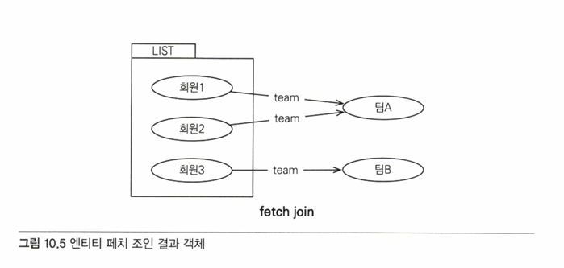

# 10 객체지향 쿼리 언어   
JPA는 복잡한 검색 조건을 사용해서 엔티티 객체를 조회할 수 있는 다양한 쿼리 기술을 지원한다.   

## 10.1 객체지향 쿼리 소개   
- 엔티티의 단순한 검색 방법
  - 식별자로 조회 EntityManager.find()
  - 객체 그래프 탐색 (ex. a.getB().getC())
   
but 너무 단순해서 복잡한 검색이 불가능   
-> JPQL이 생김   
   
- JPQL(Java Persistence Query Language)의 특징
  - 테이블이 아닌 객체를 대상으로 검색하는 객체지향 쿼리
  - SQL을 추상화해서 특정 데이터베이스 SQL에 의존X
   
JPA: 엔티티 객체를 대상으로 하는 객체지향 쿼리로, JPA가 JPQL을 분석한 다음 적절한 SQL을 만들어서 DB를 조회, 조회 결과로 엔티티 객체를 생성해서 반환   
   
- JPA가 공식 지원하는 검색 기능
  - JPQL
  - Criteria 쿼리: JPQL을 편하게 작성하도록 도화주는 API, 빌더 클래스 모음
  - 네이티브 SQL: JPA에서 JPQL 대신 직접 SQL을 사용
   
- JPA가 공식 지원X, 알아두면 좋은 검색 기능
  - QueryDSL: Criteria 쿼리처럼 JPQL을 편하게 작성하도록 도와주는 빌더 클래스 모음, 비표준 오픈소스 프레임워크
  - JDBC 직접 사용, MyBatis 같은 SQL 매퍼 프레임워크 사용: 필요하면 JDBC를 직접 사용할 수 있다.
   
### 10.1.1 JPQL 소개   
JPQL은 엔티티 객체를 조회하는 객체지향 쿼리다. 문법은 SQL과 비슷하고 ANSI 표준 SQL이 제공하는 기능을 유사하게 지원   
JPQL은 SQL을 추상화해서 특정 DB에 의존하지 않는다.   
DB 방언만 변경하면 JPQL을 수정하지 않아도 자연스럽게 DB를 변경할 수 있다.   
(EX. 같은 SQL 함수라도 DB마다 사용 문법이 다른 것이 있는데, JPQL이 제공하는 표준화된 함수를 사용하면 선택한 방언에 따라 해당 DB에 맞춘 적절한 SQL 함수가 실행된다.)   
   
JPQL은 엔티티 직접 조회, 묵시적 조인, 다형성 지원으로 SQL보다 코드가 간결하다.   
   
```java
@Entity (name="Member") //name 속성의 기본값은 클래스 명 
public class Member {
  @Column (name = "name") 
  private String username; 
  //...
}
```
[↑ 회원 엔티티]   
```java
// 쿼리 생성
String jpql = "select m from Member as m where m.username = 'kim'"; 
List<Member> resultList =
  em.createQuery(jpql, Member.class).getResultList();
```
[↑ JPQL 사용]   
   
회원이름이 kim인 엔티티를 조회.   
m.username은 엔티티 객체의 필드명이다.   
   
1. em.createQuery() 메서드에 실행할 JPQL과 반환할 엔티티의 클래스 타입을 넘기고
2. getResultList() 메서드들 실행하면
3. JPA는 JPQL을 SQL로 변관해서 DB를 조회,
4. Member 엔티티를 생성해서 반환
   
```
select m
from Member as m 
where m.username = 'kim'
```
   
```sql
 select
  member.id as id, 
  member.age as age, 
  member.team_id as team, 
  member.name as name
from
  Member member 
where
  member.name= 'kim'
```
   
### 10.1.2 Criteria 쿼리 소개   
Criteria: JPQL을 생성하는 빌더 클래스   
장점: 문자가 아닌 query.select(m).where(...)처럼 프로그래밍 코드로 JPQL을 작성할 수 있다는 것   
   
- 문자로 작성한 JPQL보다 코드로 작성한 Criteria의 장점
  - 컴파일 시점에 오류를 발견할 수 있다.
  - IDE를 사용하면 코드 자동완성을 지원한다.
  - 동적 쿼리를 작성하기 편하다.
   
```java
// Criteria 사용 준비
CriteriaBuilder cb = em.getCriteriaBuilder(); 
CriteriaQuery<Member> query = cb.createQuery(Member.class);

// 루트 클래스 (조회를 시작할 클래스)
Root<Member> m = query.from(Member.class);

//쿼리 생성
CriteriaQuery<Member> cq =
 query.select (m).where(cb.equal(m.get("username"), "kim")); 
List<Member> resultList = em.createQuery(cq).getResultList();
```
Criteria는 동적 쿼리를 작성할 때 유리하기도 함   
but 복잡하고 장황 -> 사용 불편, 코드도 한 눈에 들어오지 X 단점 존재   
   
### 10.1.3 QueryDSL 소개   
Criteria처럼 JPQL 빌더 역할을 한다.   
＋ 코드 기반이면서 단순하고 사용하기 쉽다.   
＋ JPQL과 코드가 비슷해서 한 눈에 들어온다.   
   
```java
// 준비
JPAQuery query = new JPAQuery(em); 
QMember member = QMember.member;

// 쿼리, 결과조회 
List<Member> members = 
  query.from(member)
   .where(member.username.eq("kim")) 
  .list(member);
```
[↑ QueryDSL 코드]   
QueryDSL도 어노테이션 프로세서를 사용해서 쿼리 전용 클래스를 만들어야 한다.   
여기에서 QMember가 엔티티 클래스 기반으로 생성한 QueryDSL 쿼리 전용 클래스   
   
### 10.1.4 네이티브 SQL 소개   
SQL을 직접 사용할 수 있는 기능   
   
가끔은 특정 DB에 의존하는 기능을 사용해야 할 때가 있다.   
이럴 때 사용하는데, 네이티브 SQL의 단점은 특정 DB에 의존하는 SQL을 작성해야해서,   
데이터베이스를 변경하면 네이티브 SQL도 수정해야 한다.   
   
```java
 String sql = "SELECT ID, AGE, TEMI_ID, NAME FROM MEMBER WHERE NAME = 'kim'";
 List<Member> resultList = em.createNativeQuery(sql, Member.class).getResultList();
```
[↑ 네이티브 SQL]   
   
### 10.1.5 JDBC 직접 사용, 마이바티스 같은 SQL 매퍼 프레임워크 사용   
JDBC 커넥션에 직접 접근하고 싶으면 JPA는 JDBC 커넥션을 획득하는 API를 제공 X   
-> JPA 구현체가 제공하는 방법 사용   
   
```java
Session session = entityManager.unwrap(Session.class); 
session.doWork(new Work() {

  @Override
  public void execute(Connection connection) throws SQLException { 
  //work...
   }
 });
```
1. JPA EntityManager에서 하이버네이트 Session을 구한다.
2. Session의 doWork() 메서드를 호출한다.
   
＊JDBC나 마이바티스를 JPA와 함께 사용하면 영속성 컨텍스트를 적절한 시점에 강제로 플러시 해야 한다.   
위 방법은 JPA를 우회해서 데이터베이스에 접근을 하는데, JPA는 우회해서 접근하는 SQL을 인식X   
-> 영속성컨텍스트와 DB를 불일치 상태로 만들어 데이터의 무결성이 훼손될 수도 있다.   
   
**JPA를 우회해서 SQL을 실행하기 직전에 영속성 컨텍스트를 수동으로 플러시해서 DB와 영속성 컨텍스트를 동기화하면 된다.**   
스프링 프레임워크의 AOP를 적절히 활용해서 JPA를 우회해, DB에 접근하는 메서드를 호출할 때마다 영속성 컨텍스트를 플러시 하면 된다.   
   
## 10.2 JPQL   
- JPQL의 특징
   - JPQL은 객체지향 쿼리 언어이다. ∴ 테이블 대상X, 엔티티 객체를 대상
   - JPQL은 SQL을 추상화해서 특정 DB SQL에 의존X
   - JPQL은 결국 SQL로 변환된다.
   
   
회원이 상품을 주문하는 다대다 관계   
   
### 10.2.1 기본 문법과 쿼리 API   
JPQL도 SQL과 비슷하게 SELECT, UPDATE, DELETE문 사용 가능   
엔티티 저장 시에는 EntityManager.persist() 메서드들 사용하면 되기에 INSERT문은 X   
   
```java
select_문 :: = 
  select_절 
  from 절 
  [where_ 절]
  [groupby_절]
  [having_절]
  [orderby_절]

update_문 :: = update_절 [where_절] 
delete_문 :: = delete_절 [where_절]
```
   
#### SELECT 문   
```java
 SELECT m FROM Member AS m where m.username = 'Hello'
```
   
－ 대소문자 구분   
엔티티와 속성은 대소문자를 구분한다.(ex. Member, username)   
SELECT, FROM, AS 같은 JPQL 키워드는 대소문자 구분X   
   
－ 엔티티 이름   
클래스 명이 아니라 엔티티 명을 사용한다. @Entity(name = "XXX")로 지정하지 않았으면, 클래스명을 기본값으로 사용   
   
－ 별칭은 필수   
Member AS m을 보면 Member에 m이라는 별칭을 주었다. (AS는 생략 가능)   
   
#### TypeQuery, Query   
작성한 JPQL을 실행하려면 쿼리 객체를 만들어야 한다.   
   
- TypeQuery: 반환할 타입을 명확하게 지정할 수 있을 때 사용
- Query: 반환 타입을 명확하게 지정할 수 없을 때 사용
   
```java
TypedQuery<Member> query =
  em.createQuery ("SELECT m FROM Member m", Member.class);

List<Member> resultList = query.getResultList(); 
for (Member member : resultList) {
 System.out.println("member = ” + member);
}
```
[↑ TypeQuery 사용]   
em.createQuery()의 두 번째 파라미터에 반환할 타입을 지정 -> TypeQuery 반환, 지정x -> Query 반환   
   
```java
Query query =
  em.createQuery("SELECT m.username, m.age from Member m") ;
List resultList = query.getResultList();

for (Object o : resultList) {
  Object [] result = (Object []) o; // 결과가 둘 이상이면 Object [ ] 반환 
  System.out.println("username = " + result[0]);
  System.out.println ("age = " + result[1]);
}
```
조회 대상이 String 타입인 회원 이름, Integer 타입인 나이이므로 명확하지 x   
-> Query 객체를 사용   
   
Query 객체는 SELECT 절의 조회 대상이 둘 이상 -> Object[]를 반환, 하나 -> Object 반환   
   
타입을 변환할 필요가 없는 TypeQuery를 사용하는 것이 더 편리하긴 하다.   
   
#### 결과 조회   
다음 메서드들을 호출하면 실제 쿼리를 실행해서 DB를 조회한다.   
- query.getResultList(): 결과를 예제로 반환. 결과가 없으면 빈 컬렉션을 반환
- query.getSingleResult(): 결과가 정확히 하나일 때 사용
  - 결과x: javax.persistence.NoResultException 예외 발생
  - 결과 2개 이상: javax.persistence.NonUniqueResultException 예외 발생
   
### 10.2.2 파라미터 바인딩   
－ 이름 기준 파라미터   
파라미터를 이름으로 구분하는 방법.   
파라미터 앞에 ":"를 사용한다.   
   
```java
String usernameParam = "User1";

TypedQuery<Member> query =
 em.createQuery("SELECT m FROM Member m where m.username = :username", 
Member.class);

query.setParameter ("username", usernameParam);
List<Member> resultList = query.getResultList();
```

```java
// JPQL API는 대부분 메서드 체인 방식으로 설계되어 있어서 다음과 같이 연속 작성 가능
List<Member> members =
 em.createQuery("SELECT m FROM Member m where m.username = :username" 
, Member.class)
 .setParameter ("username", usernameParam)
 .getResultList();
```
   
－ 위치 기준 파라미터   
"?" 다음에 위치 값을 주면 된다. 위치 값은 1부터 시작   
   
```java
List<Member> members =
 em.createQuery("SELECT m FROM Member m where m.username 
  = ?1", Member.class)
 .setParameter(1,usernameParam)
 .getResultList();
```
위치 기준 파라미터 방식 보다는 이름 기준 파라미터 바인딩 방식을 사용하는 것이 더 명확하다.   
   
＋ 파라미터 바인딩 방식을 사용하지 않으면 sql 인젝션 공격을 당하거나 성능 이슈가 생길 수도 있기 때문에 파라미터 바인딩 방식을 사용하자.   
```java
// 파라미터 바인딩 방식 사용x, 직접 JPQL을 만들어서 사용한 예씨
"select m from Member m where m.username = '" + usernameParam + "'"
```
   
### 10.2.3 프로젝션   
: SELECT 절에 조회할 대상을 지정하는 것   
   
[SELECT {프로젝션 대상} FROM]으로 대상을 선택한다.   
프로젝션 대상: 엔티티, 임베디드 타입, 스칼라 타입(숫자, 문자 등 기본 데이터 타입)   
   
－ 엔티티 프로젝션   
```java
SELECT m FROM Member m  //회원
SELECT m.team FROM Member m // 팀
```
원하는 객체를 바로 조회한 것으로, 조회한 엔티티는 영속성 컨텍스트에서 관리된다.   
   
－ 임베디드 타입 프로젝션   
임베디드 타입은 조회의 시작점이 될 수 없다는 제약이 있다.   
```java
 String query = "SELECT a FROM Address a"; // 임베디드 타입인 Address를 조회의 시작점으로 사용해서 잘못된 쿼리
```
->
```java
 String query = "SELECT o.address FROM Order o";
 List<Address> addresses = em.createQuery(query, Address.class)
     .getResultList();
```
시작점인 Order 엔티티부터 시작한 임베디드 타입 조회   

```sql
select
 order.city, 
 order.street, 
 order.zipcode
from
 Orders order
```
실행된 SQL   
   
임베디드 타입은 엔티티 타입이 아닌 값 타입이다.   
∴ 직접 조회한 임베디드 타입은 영속성 컨텍스트에서 관리X   
   
－ 스칼라 타입 프로젝션   
```java
// 전체 회원의 이름 조회
 List<String> usernames =
   em.createQuery("SELECT username FROM Member m", String.class)
   .getResultList();
```
   
```java
// 중복 데이터 제거
SELECT DISTINCT username FROM Member m
```
    
```java
// 통계 쿼리도 스칼라 타입으로 조회
 Double orderAmountAvg =
 em.createQuery("SELECT AVG(o.orderAmount) FROM Order o", Double.class)
 .getSingleResult();
```
   
－ 여러 값 조회   
엔티티를 통째로 조회하는 것이 편리하긴 하지만, 꼭 필요한 데이터들만 선택해서 조회해야 할 때도 있다.   
-> TypeQuery 사용불가, Query 사용   
   
```java
Query query =
 em. createQuery ("SELECT m.username, m.age FROM Member m"); 
List resultList = query.getResultList();

Iterator iterator = resultList.iterator(); 
while (iterator.hasNext()) {
 Object[] row = (Object[]) iterator.next();
 String username = (String) row[0];
 Integer age = (Integer) row[1];
}
```
[↑ 여러 프로젝션]   
   
```java
List<Object[]> resultList =
 em.createQuery("SELECT m.username, m.age FROM Member m") 
    .getResultList();

for (Object[] row : resultList) {
 String username = (String) row[0];
 Integer age = (Integer) row[1];
}
```
[↑ 여러 프로젝션 Object[]로 조회]   
   
스칼라 타입 뿐만 아니라 엔티티 타입도 여러 값을 함께 조회할 수 있다.   
```java
List<Object[]> resultList =
   em.createQuery ("SELECT o.member, o.product, o.orderAmount FROM Order o") 
    .getResultList();

for (Object[] row : resultList) {
  Member member = (Member) row[0]; // 엔티티
  Product product = (Product) row[1]; //엔티티 
  int orderAmount = (Integer) row[2] ; //스칼라
}
```
[↑ 여러 프로젝션 엔티티 타입 조회]   
**조회한 엔티티는 영속성 컨텍스트에서 관리된다.**   
   
－ NEW 명령어   
실제 애플리케이션 개발 시에는 Object[]를 직접 사용x, UserDTO처럼 의미 있는 객체로 변환해서 사용할 것   
```java
List<Object[]> resultList =
 em.createQuery("SELECT m.username, m.age FROM Member m")
.getResultList();

// 객체 변환 작업
List<UserDTO> userDTOs = new ArrayList<UserDTO>(); 
for (Object[] row : resultList) {
 UserDTO userDTO = new UserDTO((String)row[0], (Integer)row[1]); 
userDTOs.add(userDTO);
}
return userDTOs;
```
[↑ NEW 명령어 사용 전]   
   
```java
public class UserDTO {
  private String username; 
  private int age;
  
  public UserDTO(String username, int age) ( 
    this.username = username; 
    this.age = age;
   }
 //...
}
```
   
```java
TypedQuery<UserDTO> query =
 em.createQuery("SELECT new jpabook.jpql.UserDTO(m.username, m.age) 
 FROM Member m", UserDTO.class);

List<UserDTO> resultList = query.getResultList();
```
[↑ NEW 명령어 사용 후]   
   
SELECT 다음에 NEW 명령어를 사용하면 반환받을 클래스를 지정할 수 있고, 이 클래스의 생성자에 JPQL 조회 결과를 넘겨줄 수 있다.   
   
- NEW 명령어를 사용할 때의 주의사항
  - 패키지 명을 포함한 전체 클래스 명을 입력해야 한다.
  - 순서와 타입이 일치하는 생성자가 필요하다.
    
### 10.2.4 페이징 API   
- JPA가 API로 추상화한 페이징
  - setFirstResult(int startPosition): 조회 시작 위치(0부터 시작한다)
  - setMaxResults(int maxResult): 조회할 데이터 수
   
```java
TypedQuery<Member> query =
 em.createQuery ("SELECT m FROM Member m ORDER BY m.username DESC", 
  Member.class);

query.setFirstResult(10); 
query.setMaxResults(20); 
query.getResultList();
```
[↑ 페이징 사용]   
11번째부터 시작해서 총 20건의 데이터 조회(-> 11 ~ 30번 데이터를 조회)   
   
   
   
   
페이징 SQL을 최적화하고 싶다면 JPA가 제공하는 페이징 API가 아닌 네이티브 SQL을 직접 사용해야함   
   
### 10.2.5 집합과 정렬   
집합은 집합함수와 함께 통계 정보를 구할 때 사용한다.   
   
#### 집합함수   
|함수|설명|
|-----|----------------------|
|COUNT|결과 수를 구한다. 반환 타입: Long|
|MAX, MIN|최대, 최소 값을 구한다. 문자, 숫자, 날짜 등에 사용한다.|
|AVG|평균값을 구한다. 숫자타입만 사용할 수 있다. 반환 타입: Double|
|SUM|합을 구한다. 숫자타입만 사용할 수 있다. 반환 타입: 정수합 Long, 소수합: Double, BigInteger합: BigInteger, BigDecimal합: BigDecimal|
   
#### 집합 함수 사용 시 참고사항   
- NULL 값은 무시하므로 통계에 잡히지 않는다. (DISTINCT가 정의되어 있어도 무시됨)
- 만약 값이 없는데 SUM, AVG, MAX, MIN 함수를 사용하면 NULL이 된다. (COUNT는 0)
- DISTINCT를 집합 함수 안에 사용해서 중복된 값을 제거하고 나서 집합을 구할 수 있다.
- DISTINCT를 COUNT에서 사용할 때 임베디드 타입은 지원하지 않는다.
   
#### GROUP BY, HAVING   
```java
 groupby_절 ::= GROUP BY {단일값 경로 | 별칭} +
 having_절 ::= HAVING 조건식
```
보통 이런 쿼리를 리포팅 쿼리 or 통계쿼리라 한다.   
결과가 아주 많다면 통계 결과만 저장하는 테이블을 별도로 만들어 두고 사용자가 적은 새벽에 통계 쿼리를 실행해서 결과를 보관하는 것이 좋다.   
   
#### 정렬(ORDER BY)   
```java
orderby_절 ::= ORDER BY {상태필드 경로 | 결과 변수 [ASC | DESC]}+ 
```
   
### 10.2.6 JPQL 조인   
### 내부 조인   
(INNER) JOIN 사용   
```java
String teamName = "팀A";
String query = "SELECT m FROM Member m INNER JOIN m.team t "
+ "WHERE t.name = : teamName";

List<Member> members = em.createQuery(query, Member.class)
 .setParameter("teamName", teamName)
 .getResultList();
```

```java
// JPQL
 SELECT m
 FROM Member m INNER JOIN m.team t
 where t.name = :teamName
```

```SQL
// SQL
SELECT
 M.ID AS ID,
 M.AGE AS AGE,
 M.TEAM_ID AS TEAM_ID,
 M.NAME AS NAME
FROM
 MEMBER M INNER JOIN TEAM T ON M.TEAM_ID=T.ID 
WHERE
 T.NAME=?
```
   
JPQL 조인은 연관 필드를 사용한다는 특징이 있다.   
- FROM Member m: 회원을 선택하고 m이라는 별칭을 주었다.
- Member m JOIN m.team t: 회원이 가지고 있는 연관 필드로 팀과 조인한다. 조인한 팀에는 t라는 별칭을 주었다.
   
JPQL은 JOIN 명령어 다음에 조인할 객체의 연관 필드를 사용한다.   
```
FROM Member m JOIN Team t // 잘못된 JPQL 조인, 오류
```
   
#### 외부 조인   
OUTER 생략 가능
```java
 SELECT m
 FROM Member m LEFT [OUTER] JOIN m.team t
```
   
```java
SELECT
 M.ID AS ID,
 M.AGE AS AGE,
 M.TEAM_ID AS TEAM_ID,
 M.NAME AS NAME
FROM
 MEMBER M LEFT OUTER JOIN TEAM T ON M.TEAM_ID=T.ID 
WHERE
 T.NAME=?
```
   
### 컬렉션 조인   
일대다 관계 OR 다대다 관계처럼 컬렉션을 사용하는 곳에 조인하는 것   
   
- [회원 -> 팀] 다대일 조인, 단일 값 연관 필드(m.team)를 사용
- [팀 -> 회원] 일대다 조인, 컬렉션 값 연관 필드(m.members)를 사용
   
```java
 SELECT t, m FROM Team t LEFT JOIN t.members m
```
   
### 세타 조인   
세타 조인은 내부 조인만 지원, WHERE 절을 사용해서 할 수 있다.   
전혀 관계 없는 엔티티 조인 가능.
   
```java
//JPQL
select count(m) from Member m, Team t 
where m.username = t.name

//SQL
SELECT COUNT(M.ID)
FROM
 MEMBER M CROSS JOIN TEAM T 
WHERE
 M.USERNAME=T.NAME
```
[↑ 회원 이름이 팀 이름과 똑같은 사람 수를 구하는 예]   
   
### JOIN ON 절(JPA 2.1)   
JPA 2.1부터 조인할 떄 ON 절을 지원한다. ON절을 사용하면 조인 대상을 필터링하고 조인할 수 있다.   
보통 ON절은 외부조인에서만 사용한다.   
```java
// JPQL
select m,t from Member m
left join m.team t on t.name = 'A'

//SQL
SELECT m.*, t.* FROM Member m
LEFT JOIN Team t ON m.TEAM ID=t.id and t.name='A'
```
and t.name = 'A'로 조인 시점에 조인 대상을 필터링한다.   
   
### 10.2..7 페치 조인   
JPQL에서 성능 최적화를 위해 제공하는 기능으로 연관된 엔티티, 컬렉션을 한 번에 조회하는 기능   
   
```
페치 조인 ::= [ LEFT [OUTER] | INNER ] JOIN FETCH 조인경로
```
   
#### 엔티티 페치 조인   
페치 조인을 사용해서 회원 엔티티를 조회하면서 연관된 팀 엔티티도 함께 조회   
```java
 select m
   from Member m join fetch m.team
```
join 다음에 jetch를 적어서 연관된 엔티티, 컬렉션을 함꼐 조인   
-> 회원(m)과 팀(m.team)을 함께 조회   
   
＋ 보통은 m.team 다음에 t처럼 별칭을 주는데, 페치 조인은 별칭 사용x   
   
```sql
SELECT M .*, T.*
  FROM MEMBER T
 INNER JOIN TEAM T ON M.TEAM_ID=T.ID
```
   
   
   
   
select m으로 회원 엔티티만 선택했는데, 회원과 연관된 팀도 함께 조회됨   
   
```java
String jpql = "select m from Member m join fetch m.team";

List<Member> members = em.createQuery(jpql, Member.class) 
  .getResultList();

for (Member member : members) {
  //페치 조인으로 회원과 팀을 함께 조회해서 지연 로딩 발생 안 함 
  System.out.println("username = " + member.getUsername() + ", " +
    "teamname = " + member.getTeam().name());
}
```
[↑ 페치 조인 사용]   

== 출력결과 ==   
username = 회원1, teamname = 팀A   
username = 회원2, teamname = 팀A   
username = 회원3, teamname = 팀B   
   
연관된 팀 엔티티는 프록시가 아닌 실제 엔티티다. -> 연관된 팀을 사용해도 지연 로딩 일어나지 x   
회원 엔티티가 준영속 상태가 되어도 연관된 팀을 조회할 수 있다. (?? 준영속인데 어케 조회??)   
   
#### 컬렉션 페치 조인   
일대다 컬렉션 페치 조인   
```
 select t
 from Team t join fetch t.members
 where t.name = ，팀 A，
```
   
```sql
SELECT T.*, M.*
 FROM TEAM T
 INNER JOIN MEMBER M ON T.ID=M.TEAM_ID 
WHERE T.NAME = '팀A'
```
   
   

(TEAM 테이블에서는 결과에 맞는 값이 하나지만 MEMBER 테이블과 조인함으로써 2건으로 조회됨)   
   
＋ 일대다 조인은 결과가 증가할 수 있지만 일대일, 다대일 조인은 결과가 증가X   
   
```
String jpql = "select t from Team t join fetch t.members where t.name = '팀A'"; 
List<Team> teams = em.createQuery(jpql, Team.class).getResultList();

for(Team team : teams) {
  System.out.println (T.teamname = " + team.getName () + ", 
  team = " + team);

  for (Member member : team.getMembers()) {
  // 페치 조인으로 팀과 회원을 함께 조회해서 지연 로딩 발생 안 함 
  System.out.println(
   "-> username = " + member.getUsername() + ", 
    member = " + member);
  }
}
```
[↑ 컬렉션 페치 조인 사용]   
   
== 출력결과 ==   
   
-> 같은 '팀A'가 2건 조회됨   
   
#### 페치 조인과 DISTINCT   
```
 select distinct t
 from Team t join fetch t.members
 where t.name = ，팀 A，
```
SQL에 DISTINCT가 추가 되지만, SQL에서는 효과가 없음   
   
   
애플릴케이션에서 distinct를 보고 중복된 데이터를 걸러낸다.   
＊ select distinct t의 의미는 팀 엔티티의 중복을 제거하라는 것   
->   
   
   
#### 페치 조인의 특징과 한계   
페치 조인을 사용하면 SQL 한 번으로 연관된 엔티티들을 함께 조회할 수 있어 SQL 호출 횟수를 줄여 성능 최적화 가능   
   
엔티티에 직접 적용하는 로딩 전략인 글로벌 로딩 전략을 지연 로딩으로 설정해도 JPQL에서 페이 조인을 사용하면 페치 조인을 적용해서 함께 조회됨   
```
 @0neToMany (fetch = FetchType.LAZY) / / 글로벌 로딩 전략
```
   
한꺼번에 안쓴느 엔티티까지 조회하면 .. 너무 비효율적이니   
글로벌 로딩 전략은 될 수 있으면 지연 로딩을 사용하고, 최적화가 필요하면 페치 조인을 적용하라 !   
   
－ 페치 조인의 한계   
1. 페치 조인 대상에는 별칭을 줄 수 없다.
- SELECT, WHERE절, 서브쿼리에 페치조인 대상 사용 불가능
2. 둘 이상의 컬렉션 페치 불가능
3. 컬렉션을 페치 조인하면 페이징 API(setFirstResult, setMaxResult)를 사용할 수 없다.
   
페치 조인은 성능 최적화에 상당히 유용하지만 여러 테이블에서 필요한 필드들만 조회해서 DTO로 반환하는 것이 더 효과적일 수도~   
   
### 10.2.8 경로 표현식   
: 쉽게 이야기 해서 .(점)을 찍어 객체 그래프를 탐색하는 것   
   
```
 select m.username 
from Member m
 join m.team t 
join m.orders o 
where t.name = '팀A'
```
-> m.username, m.team, m.orders, t.name이 경로 표현식을 사용한 예   
   
- 상태 필드: 단순히 값을 저장하기 위한 필드
- 연관 필드: 연관관계를 위한 필드, 임베디드 타입 포함
  - 단일 값 연관 필드: @ManyToOne, @OneToOne 대상이 엔티티
  - 컬렉션 값 연관 필드: @OneToMany, @ManyToMany 대상이 컬렉션
   
```java
@Entity
public class Member {
  @Id @GeneratedValue 
  private Long id;

  @Column (name = "name")
  private String username; //상태 필드
  private Integer age; //상태 필드

  @ManyToOne(..)
  private Team team; // 연관 필드 (단일 값 연관 필드)

  @OneToMany(..)
  private List<Order> orders; // 연관 필드(컬렉션 값 연관 필드)
```
- 상태 필드: t.username, t.age
- 단일 값 연관 필드: m.team
- 컬렉션 값 연관 필드: m.orders
   
#### 경로 표현식과 특징   
- 상태 필드 경로: 경로 탐색의 끝이다. 더는 탐색할 수 없다.
- 단일 값 연관 경로: 묵시적으로 내부 조인이 일어난다. 단일 값 연관 경로는 계속 탐색할 수 있다.
- 컬렉션 값 연관 경로: 묵시적으로 내부 조인이 일어난다. 너는 탐색할 수 없다. 단 FROM절에서 조인을 통해 별칭을 얻으면 별칭으로 탐색할 수 있다.
   
#### 경로 탐색을 사용한 묵시적 조인 시 주의사항   
- 항상 내부 조인이다.
- 컬렉션은 경로 탐색의 끝이다. 컬렉션에서 경로 탐색을 하려면 명시적으로 조인해서 별칭을 얻어야 한다.
- 경로 탐색은 주로 SELECT, WHERE절에서 사용하지만 묵시적 조인으로 인해 SQL의 FROM절에 영향을 준다.
   
### 10.2.9 서브 쿼리   
JPQL에서의 서브쿼리는 WHERE, HAVING절에서만 사용 가능   
   
   
   
   
### 10.2.10 조건식   
   
   

---------------------------------
## 10.4 QueryDSL   
- JPA Criteria의 장점
  - 문법 오류를 컴파일 단계에서 잡을 수 있다.
  - IDE 자동완성 기능의 도움을 받을 수 있다.
   
- JPA Criteria의 단점
  - 너무 복잡하고 어렵다
   
=> 쿼리를 문자가 아닌 코드고 작성해도, 쉽고 간결하며 그 모양도 쿼리와 비슷하게 개발할 수 있는 **Query DWL**을 사용하게됨.   
   
QueryDSL은 오픈소스 프로젝트다.   
   
### 10.4.1 QueryDSL 설정   
필요 라이브러리   
```xml
<!--pom.xml 추가-->
<dependency>
  <groupId>com.mysema.querydsl</groupId>
  <artifactld>querydsl-jpa</artifactld>
  <version>3.6.3</version〉
</dependency>

<dependency>
  <groupId>com.mysema.querydsl</groupId>
  <artifactld>querydsl-apt</artifactld> 
  <version>3.6.3</version> 
  <scope>provided</scope>
</dependency〉
```
- querydsl-jpa: QueryDSL JPA 라이브러리
- querydsl-apt: 쿼리 타입(Q)을 생성할 때 필요한 라이브러리
   
환경설정   
QueryDSL을 사용하려면 엔티티를 기반으로 쿼리타입이라는 쿼리용 클래스를 생성해야 한다.   
   
```xml
<!--쿼리 타입 생성용 pom.xml 추가-->
<build>
  <plugins>
    <plugin>
      <groupId>com.mysema.maven</groupId> 
      <artifactld>apt-maven-plugin</artifactld>
      <version>l.1.3</version>
      <executions>
        <execution>
        <goals>
         <goal>process</goal>
         </goals>
         <configuration>
          <outputDirectory>target/generated-sources/java 
          </outputDirectory>
          <processor>com.mysema.query.apt.jpa.JPAAnnotation
       Processor</processor>
          </configuration〉
        </execution>
      </executions>
   </plugin>
 </plugins>
</build>
```
콘솔에서 mvn compile을 입력하면 outputDirectory에 지정한 target/generated-souces 위치에 QMember.java처럼 Q로 시작하는 쿼리 타입들이 생성된다.   
   
### 10.4.2 시작   
```java
// QueryDSL 시작
public void queryDSL() {
  EntityManager em = emf.createEntityManager();
  JPAQuery query = new JPAQuery(em); // 엔티티 매니저를 생성자에 넘겨준다.
  QMember qMember = new QMember ("m") ; // 생성되는 JPQL의 별칭이 m 
  List<Member> members = 
    query.from(qMember)
       .where(qMember.name.eq("회원l"))
       .orderBy(qMember.name.desc())
       .list(qMember);
}
```

- 기본 Q 생성   
쿼리 타입(Q)은 사용하기 편리하도록 기본 인스턴스를 보관하고 있다.   
하지만 같은 엔티티를 조인하거나 같은 엔티티를 서브쿼리에 사용하면 같은 별칭이 사용되므로 이때는 별칭을 직접 지정해서 사용해야 한다.   
   
   
### 10.4.3 검색 조건 쿼리   
```java
JPAQuery query = new JPAQuery(em);
Qltem item = QItern.item;
Listcitem〉 list = query.from(item)
  .where (item.name.eq("좋은상품").and(item.price.gt(20000))) 
  .list (item) ; //조회할 프로젝션 지정
```
->
```
select item 
from Item item
where item.name = ?1 and item.price > ?2
```

QueryDSL의 where절에는 and나 or를 사용할 수 있다.   
또한 다음처럼 여러 검색 조건을 사용해도 되고, 이때는 and 연산이 된다.   
```
 .where (item.name.eq("좋은상품"), item.price.gt(20000))
```
   
＋ 코드로 작성되어 있으므로 IDE가 제공하는 코드 자동 완성 기능의 도움을 받으면 필요한 메서드를 손쉽게 찾을 수 있다.   
   
### 10.4.4 결과 조회   
쿼리 작성이 끝나고 결과 조회 메서드를 호출하면 실제 DB를 조회한다.   
보통 uniqueResult()나 list()를 사용하고 파라미터로 프로젝션 대상을 넘겨준다.   
   
- 결과 조회 메서드
  - uniqueResult(): 조회 결과가 한 건일 때 사용한다. 조회 결과가 없으면 null을 반환하고, 결과가 하나 이상이면 com.mysema.query.NonUniqueResultException 예외 발생
  - singleResult(): uniqueResult()와 같지만 결과가 하나 이상이면 처음 데이터를 반환한다.
  - list(): 결과가 하나 이상일 때 사용한다. 결과가 없으면 빈 컬렉션을 반환한다.
   
### 10.4.5 페이징과 정렬   
```java
Qltem item = QItern.item;

query.from(item)
 .where(item.price.gt(20000))
 .orderBy(item.price.desc(), item.stockQuantity.asc()) 
 .offset(10).limit(20) // 10번부터 20개까지
 .list(item);
```
   
```java
QueryModifiers queryModifiers = new QueryModifiers (20L, 10L) ; //limit, offset 20건의 결과를 가져오되, 10건을 건너뛰어 시작
List<Item> list = 
  query.from(item)
  .restrict(queryModifiers)
  .list(item);
```
QueryModifiers: 쿼리에 대한 제약 조건을 정의하는 데 사용되는 클래스   
   
```java
SearchResults<Item> result = 
  query.from(item)
    .where(item.price.gt(10000))
    .offset(10).limit(20)
    .listResults(item);

long total = result.getTotal () ; // 검색된 전체 데이터 수 
long limit = result.getLimit(); 
long offset = result.getOffset();
List<item> results = result.getResults (); // 조회된 데이터
```
listResult(): 전체 데이터 조회를 위한 count 쿼리를 한 번 더 실행   
   
### 10.4.6 그룹   
```java
query, from (item)
  .groupBy(item.price)
  .having(item.price.gt(1000)) 
  .list(item);
```
groupBy, having 사용   
   
### 10.4.7 조인   
조인은 innserJoin(Join), leftJoin, rightJoin, fullJoin 뿐만 아니라 성능 최적화를 위한 fetchJoin도 사용할 수 있다.   
   
조인의 기본 문법   
1. 파라미터에 조인 대상을 지정
2. 파라미터에 별칭으로 사용할 쿼리 타입을 지정
   
```java
// 기본 조인
QOrder order = QOrder.order;
QMember member = QMember.member;
QOrderItem orderltem = QOrderltem.orderItem;

query.from(order)
 .join(order.member, member)
 .leftJoin(order.orderltems, orderltem) 
.list(order);
```
   
```java
// 조인 on 사용
query.from(order)
  .leftJoin(order.orderltems, orderltem) 
  .on(orderltem.count.gt(2))
  .list(order);
```
   
```java
query.from(order)
  .innerJoin(order.member, member).fetch()
  .leftJoin(order.orderltems, orderltem).fetch()
  .list(order);
```
   
```java
// 세타 조인(특정한 조인 조건을 사용하지 않고 두 테이블의 모든 행을 결합)
QOrder order = QOrder.order; 
QMember member = QMember.member;

query.from(order, member)
  .where(order.member.eq(member)) 
  .list(order);
```

### 10.4.8 서브 쿼리   
com.mysema.query.jpa.JPASubQuery를 생성해서 사용   
서브쿼리의 결과가 하나면 unique(), 여러 건이면 list()를 사용할 수 있다.   
   
```java
// 서브쿼리 예제 - 한 건
Qltem item = Qltem.item;
Qltem itemSub = new Qltem ("itemSub");

query, from(item)
  .where(item.price.eq(
     new JPASubQuery().from(itemSub).unique(itemSub.price.max())
   ))
 .list(item);
```
   
```
SELECT item
FROM Item item
WHERE item.price = (
    SELECT MAX(itemSub.price)
    FROM Item itemSub
);
```
   
```java
// 서브쿼리 예제 - 여러 건
Qltem item = Qltem.item;
Qltem itemSub = new Qltem("itemSub") ;

query.from(item)
  .where(item.in(
     new JPASubQuery().from(itemSub)
       .where(item.name.eq(itemSub.name)) 
       .list(itemSub)
     ))
   .list(item);
```
   
### 10.4.9 프로젝션과 결과 반환   
프로젝션: select절에 조회 대상을 지정하는 것   
   
```java
// 프로젝션 대상이 하나
Qltem item = QItern.item;
List<String> result = query.from(item).list(item.name);

for (String name : result) {
 System.out.println("name = " + name);
}
```
   
```java
// 여러 필드를 프로젝션 대상으로 선택한다면, 튜플을 사용한다.
// 튜플 사용 예제
Qltem item = Qltem.item;

List<Tuple> result = query.from(item).list(item.name, item.price); 
//List<Tuple> result = query.from(item).list(new QTuple(item.name, item.price)); 
// 같다.

for (Tuple tuple : result) {
 System.out.println("name = " + tuple.get(item.name)); 
 System.out.println("price = " + tuple.get(item.price);
}
```

빈 생성   
쿼리 결과를 엔티티가 아닌 특정 객체로 받고 싶으면 빈 생성 기능을 사용한다.   

- QueryDSL이 제공하는 객체 생성 방법
  - 프로퍼티 접근
  - 필드 직접 접근
  - 생성자 사용
   
원하는 방법을 지정하기 위해 com.mysema.query.types.Projection를 사용하면 된다.   
   
```java
public class ItemDTO {
  private String username; 
  private int price;

  public ItemDTO() {}

  public ItemDTO(String username, int price) {
    this.username = username; 
    this.price = price;
  }

  // Getter, Setter
  public String getUsername() {… }
  public void setUsername(String username) {...}
  public int getPrice() {...}
  public void setPrice(int price) {...}
}
```
   
```java
// 프로퍼티 접근(Setter)
Qltem item = Qltem.item;
List<ItemDTO> result = query.from(item).list(
  Projections.bean(ItemDTO.class, item.name.as("username"), item.price));
```

Projections.bean() 메서드는 수정자(Setter)를 사용해서 값을 채운다.   
쿼리 결과는 name인데, ItemDTO는 username 프로퍼티를 가지고 있기에 as를 사용해서 별칭을 준다.   
   
```java
// 필드 직접 접근
Qltem item = Qltem.item;
List<ItemDTO> result = query.from(item).list(
  Projections.fields (ItemDTO.class, item.name.as ("username"), 
  item.price));
```
Projections.fields() 메서드를 사용하면 필드에 직접 접근해서 값을 채워준다. 필드를 private로 설정해도 동작한다.   
   
```java
// 생성자 사용
Qltem item = Qltem.item;
 List<ItemDTO> result = query.from(item).list (
 Projections.constructor(ItemDTO,class, item.name, item.price)
);
```
Projections.constructor() 메서드는 생성자를 사용한다. 물론 지정한 프로젝션과 파라미터 순서가 같은 생성자가 필요하다.   
   
DISTINCT   
distinct는 ..   
```
 query.distinct().from(item)...
```
   
### 10.4.10 수정, 삭제 배치 쿼리   
QueryDSL도 수정, 삭제 같은 배치 쿼리를 지원한다.   
   
```java
// 수정 배치 쿼리
Qltem item = Qltem.item;
JPAUpdateClause updateClause = new JPAUpdateClause(em, item); 
long count = updateClause.where (item.name.eq("시골개발자의 JPA 책"))
  .set(item.price, item.price.add(100)) // 상품의 가격을 100원씩 증가시킴
  .execute() ;
```
-> **JPAUpdateClause**
   
```java
// 삭제 배치 쿼리
Qltem item = Qltem.item;
JPADeleteClause deleteClause = new JPADeleteClause(em, item);
long count = deleteClause.where (item.name.eq ("시골개발자의 JPA 책"))
  .execute();
```
-> **JPADeleteClause**   
   
### 10.4.11 동적 쿼리   
com.mysema.query.BooleanBuilder를 사용하면 특정 조건에 따른 동적 쿼리를 편리하게 생성할 수 있다.   
   
```java
SearchParam param = new SearchParam();
param.setName("시골개발자");
param.setPrice(10000);

Qltem item = Qltem.item;

BooleanBuilder builder = new BooleanBuilder();
if (StringUtils.hasText(param.getName())) {
 builder.and(item.name.contains(param.getName()));
}
if (param.getPrice() != null) {
  builder.and(item.price.gt(param.getPrice()));
}
List<Item> result = query.from(item)
 .where(builder)
 .list (item) ;
```
-> 상품 이름과 가격 유무에 따라 동적으로 쿼리를 생성   
   
### 10.4.12 메서드 위임   
메서드 위임 기능을 사용하면 쿼리 타입에 검색 조건을 직접 정의할 수 있다.   
   
### 10.4.13 QueryDSL 정리   
문자가 아닌 코드로 안전하게 쿼리 작성이 가능,   
복작합 동적 쿼리 해결이 가능   
   
## 10.5 네이티브 SQL   
떄로는 특정 데이터베이스에 종속적인 기능이 필요하다.   
   
－ 특정 데이터베이스에 종속적인 기능일 지원하는 방법   
- 특정 데이터베이스만 사용하는 함수
  - JPQL에서 네이티브 SQL 함수를 호출할 수 있다
  - 하이버네이트는 데이터베이스 방언에 각 데이터베이스에 종속적인 함수들을 정의해두었다. 또한 직접 호출할 함수를 정의할 수도 있다.
  - 특정 데이터베이스만 지원하는 SQL 쿼리 힌트
    - 하이버네이트를 포함한 몇몇 JPA 구현체들이 지원한다.
  - 인라인 뷰, UNION, INSERSECT
    - 하이브네이트는 지원하지 않지만 일부 JPA 구현체들이 지원한다.
  - 스토어 프로시저
    - JPQL에서 스토어드 프로시저를 호출할 수 있다.
  - 특정 데이터베이스만 지원하는 문법
    - 오라클의 CONNECT BY처럼 특정 데이터베이스에 너무 종속적인 SQL문법은 지원하지는 않는다. 이때는 네이티브 SQL을 사용해야 한다.
   
네이티브 SQL: 다양한 이유로 JPQL을 사용할 수 없을 때 SQL을 직접 사용하도록 JPQL이 지원하는 기능   
네이비트 SQL을 사용하면 엔티티를 조회할 수 있고 JPA가 지원하는 영속성 컨텍스트의 기능을 그대로 사용할 수 있다.   
   
### 10.5.1 네이티브 SQL 사용   
네이티브 쿼리 API의 3가지 종류   
```
 // 결과 타입 정의
public Query createNativeQuery(String sqlString, Class resultClass);

// 결과 타입을 정의할 수 없을 때
public Query createNativeQuery(String sqlString);

public Query createNativeQuery(String sqlString,
   String resultSetMapping); // 결과 매핑 사용
```
   
- 엔티티 조회   
네이티브 SQL은 em.createNativeQuery(SQL, 결과클래스)를 사용한다.   
첫 번째 파라미터: 네이티브 SQL 입력   
두 번쨰 파라미터: 조회할 엔티티 클래스의 타입을 입력   
   
```java
//SQL 정의 
String sql =
 "SELECT ID, AGE, NAME, TEAM_ID" + 
  "FROM MEMBER WHERE AGE > ?";

Query nativeQuery = em.createNativeQuery(sql, Member.class) 
  .setParameter(1, 20);

List<Member> resultList = nativeQuery.getResultList();
```
* 네이티브 sql로 sql만 직접 사용할 뿐이지 나머지는 jpql을 사용할 때와 같고, 조회한 엔티티도 영속성 컨텍스트에서 관리한다.
   
- 값 조회   
```java
// 값 조회
//SQL 정의 
String sql =
 "SELECT ID, AGE, NAME, TEAM_ID " + 
  "FROM MEMBER WHERE AGE > ?";

Query nativeQuery = em.createNativeQuery(sql)
.setParameter(1, 10);

List<Object[]> resultList = nativeQuery.getResultList(); 
for (Object[] row : resultList) {
 System.out.println("id = " + row[0]);
 System.out.println("age = " + row[1]);
 System.out.println ("name = " + row [2]) ;
 System.out.println("team_id = " + row[3]);
}
```
여러 값을 조회하려면 em.createNativeQuery(SQL)의 두 번째 파라미터 사용X   
-> JPA는 조회한 값들을 Object[]에 담아서 관리한다.   
   
- 결과 매핑 사용
엔티티와 스칼라 값을 함께 조회하는 것처럼 매핑이 복잡해지면 @SqlResultSetMapping을 정의해서 결과 매핑을 사용해야함
   
```java
// 결과 매핑 사용
//SQL 정의 
String sql =
 "SELECT M.ID, AGE, NAME, TEAM_ID, I.ORDER_COUNT " + 
  ",FROM MEMBER M " +
  "LEFT JOIN " +
 " (SELECT IM.ID, COUNT (*) AS ORDER_COUNT " +
 " FROM ORDERS O, MEMBER IM " +
 " WHERE O.MEMBER_ID = IM.ID) I " +
 "ON M.ID = I,ID";

 Query nativeQuery = em.createNativeQuery(sql, "memberWithOrderCount");

ListcObject[]> resultList = nativeQuery.getResultList(); 
for (Object[] row : resultList) {
 Member member = (Member) row[0];
 Biglnteger orderCount = (Biglnteger)row[l];

 System.out.println("member = ", + member);
 System.out.printIn("orderCount = " + orderCount);
```
em.createNativeQuery(sql, "memberWithOrderCount")의 두 번째 파라미터에 결과 매핑 정보의 이름이 사용되었다.   
   
```java
// 결과 매핑을 정의
@Entity
@SqlResultSetMapping (name = "memberWithOrderCount",
  entities = {@EntityResult(entityClass = Member.class)}, 
  columns = {@ColumnResult(name = :ORDER_COUNT")}
 )
 public class Member {...}
```
memberWithOrderCount의 결과 매핑을 잘 보면, 회원 엔티티와 ORDER_COUNT 컬럼을 매핑했음   
ID, AGE, NAME, TEAM_ID는 Member 엔티티와 매핑하고, ORDER_COUNT는 단순 값으로 매핑한다.   
   
결과 매핑 어노테이션   
   
   
### 10.5.4 네이티브 SQL 정리   
네이티브 SQL도 JPQL을 사용할 때와 마찬가지로 Query, TypeQuery(Named 네이티브 쿼리의 경우에만)를 반환한다.   
-> JPQL의 API를 그대로 사용할 수 있다.   
   
```java
// 네이티브 SQL과 페이징 처리
String sql = "SELECT ID, AGE, NAME, TEAM_ID FROM MEMBER"; 
Query nativeQuery = em.createNativeQuery(sql, Member.class) 
 .setFirstResult(10)
 .setMaxResults(20)
```
-> 페이징 처리 API를 사용할 수 있다.   
   
네이티브 SQL은 관리하기 쉽지 않고 자주 사용하면 특정 데이터베이스에 종속적인 쿼리가 증가해서 이식성이 떨어진다.   
하지만 아예 사용하지 않는 것은 불가능하고, 차선책으로 사용하도록 하자.   
   
### 10.5.5 스토어드 프로시저(JPA 2.1)   
JPA 2.1부터 스토어드 프로시저를 지원한다.   
    
## 10.6 객체지향 쿼리 심화   
### 10.6.1 벌크 연산   
벌크 연산: 여러 건을 한 번에 수정하거나 사용하는 연산   
EX. 재고가 10개 미만인 모든 상품의 가격을 10% 상승시키기   
```java
// UPDATE 벌크 연산
String qlString =
 "update Product p " +
 "set p.price = p.price * 1.1 " +
 "where p.stockAmount < :stockAmount";

int resultCount = em.createQuery(qlString)
                   .setParameter("stockAmount", 10) 
                    .executeUpdate();
```
벌크 연산은 excuteUpdate() 메서드를 사용한다.   
return은 벌크 연산으로 영향을 받은 엔티티 건수를 반환   
   
ex. 가격이 100원 미만인 상품을 삭제하는 코드   
```java
// DELETE 벌크 연산
String qlString =
 "delete from Product p " +
 "where p.price < :price";

int resultCount = em.createQuery(qlString)
                     .setParameter("price", 100) 
                     .executeUpdate();
```

벌크 연산 시에는 벌크 연산이 영속성 컨텍스트를 무시하고 데이터베이스에 직접 쿼리한다는 점에서 주의해야 한다.   
   
   
   
   
벌크연산의 문제점을 피하기 위한 방법   
1. em.refresh() 사용
2. 벌크 연산 먼저 실행
3. 벌크 연산 수행 후 영속성 컨텍스트 초기화
   
### 10.6.2 영속성 컨텍스트와 JPQL   
쿼리 후 영속 상태인 것과 아닌 것   
   
## 10.7 정리   
- JPQL은 SQL을 추상화해서 특정 데이터베이스 기술에 의존하지 않는다.
- Criteria나 QueryDSL은 JPQL을 만들어주는 빌더 역할을 할 뿐이므로 핵심은 JPQL을 잘 알아야 한다.
- Criteria나 QueryDSL을 사용하면 동적으로 변하는 쿼리를 편리하게 작성할 수 있다.
- Criteria는 JPQ가 공식 지원하는 기능이지만 직관적이지 않고 사용하기에 불편하다. 반면에 QueryDSL은 JPA가 공식 지원하는 기능은 아니지만 직관적이고 편리하다.
- JPA도 네이티브 SQL을 제공하므로 직접 SQL을 사용할 수 있다. 하지만 특정 데이터베이스에 종속적인 SQL을 사용하면 다른 데이터베이스로 변경하기 쉽지 않다. 따라서 최대한 JPQL을 사용하고 그래도 방법이 없을 때 네이티브 SQL을 사용하자.
- JPQL은 대량에 데이터를 수정하거나 삭제하는 벌크 연산을 지원한다.
