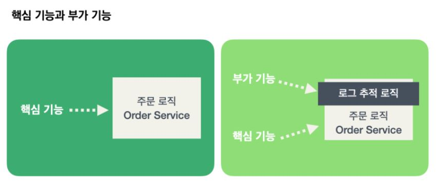
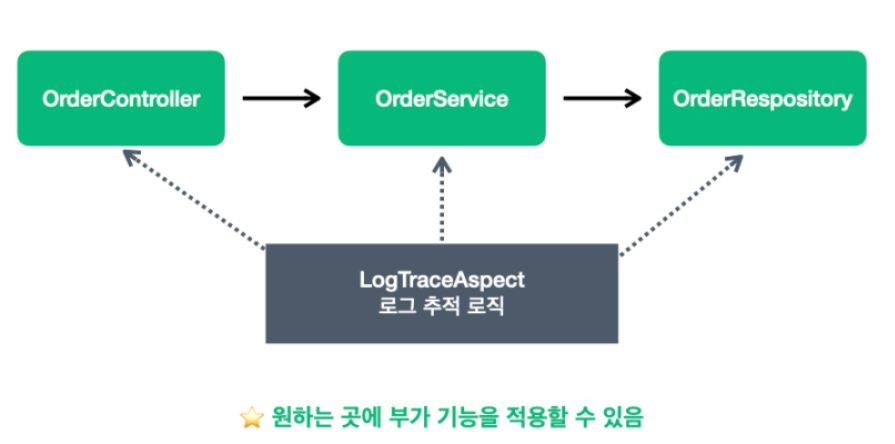

# AOP (Aspect Oriented Programming)   
AOP는 Aspect Oriented Programming의 약자로 관점 지향 프로그래밍이라고 불린다.   
관점 지향은 쉽게 말해 어떤 로직을 기준으로 핵심적인 관점, 부가적인 관점으로 나누어서 보고 그 관점을 기준으로 각각 모듈화하겠다는 것이다.   
＊ 모듈화: 어떤 공통된 로직이나 기능을 하나의 단위로 묶는 것   
   
   
[출처 : 김영한 인프런 강의 [스프링 핵심 원리 - 고급편]]   
   
핵심기능: 해당 객체가 제공하는 고유의 기능 (EX. OrderService의 핵심 기능은 주문 로직)   
부가기능: 핵심 기능을 보조하기 위해 제공되는 기능 (ex. 로그 추적 로직, ...)   
   
문제점: 부가기능을 여러 곳에 각각 적용하려면 번거롭다는 문제   
        특히 수정이 필요할 경우에는 부가기능을 호출하는 곳을 찾아서 수정해야된다.   
=> 애스팩트(aspect)를 만들었다.   
   
   
[출처 : 김영한 인프런 강의 [스프링 핵심 원리 - 고급편]]   
   
aspect: 부가 기능과 부가 기능을 어디에 적용할지 정의한 모듈   
(ex. 로그 출력 기능을 모든 컨트롤러에 적용하라는 것이 정의되어 있음)   
우리말로 직역하자면 '관점'을 뜻하고, 하나하나의 기능이 아닌 횡단 관심사(cross-cutting concerns, 소스 코드 상에서 다른 부분에 계속 반복해서 쓰는 코드) 관점으로 달리 보는 것을 말한다.   
애스펙트를 사용한 프로그래밍 방식 => 관점 지향 프로그래밍(AOP)   
   
AOP를 사용하면 핵심 기능과 부가 기능이 코드상 완전히 분리된다.   

